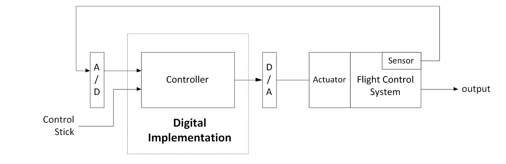
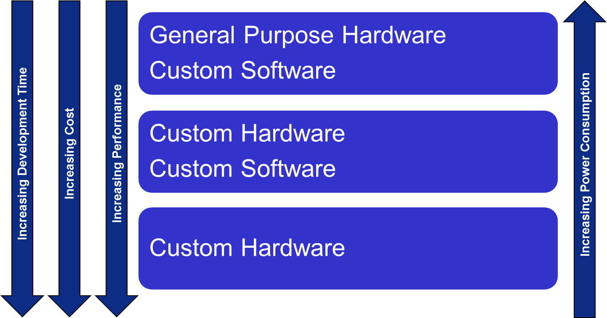
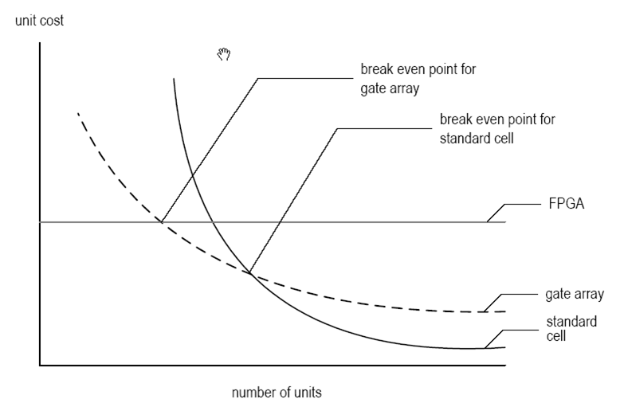
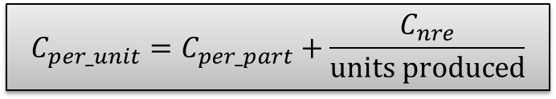
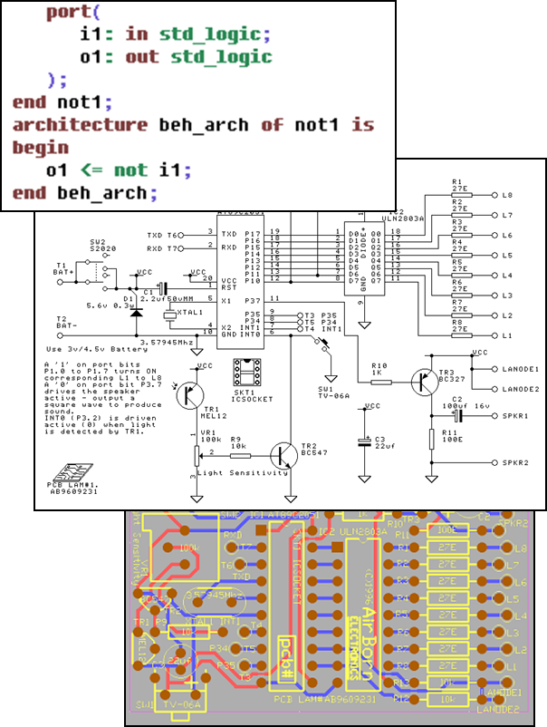
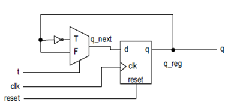

# ECE383 - Embedded Systems II

## Intro to Digital System Design

## Lesson Outline

- Some Perspective
- Why Digital Systems?
- Instructor / Course Inroduction
- Methods of Implementing Digital Systems
- Custom Digital Device Technologies
- Abstraction
- Digital System Implementation
- Design Goals

# Some Perspective

# Why Digital Systems?

## Why Digital Systems?

- Advantages
  - Reproducability of information
  - Flexibility and functionality: easier to store, transmit, and manipulate information
  - Economy: cheaper device and easier to design
- Digital circuitry replaces many analog systems
  - _Audio recording_: from tape to music CD to MP3 (MPEG Layer 3) player
  - _Image processing_: from silver-halide film to digital camera
  - Telephone switching networks
  - Control of mechanical systems: e.g. "fly-by-wire"

## Why Digital Systems?

**Fly-By-Wire Digital System**

# Instructor / Course Intro

## About Me

- Summit, NJ
- Education:
  - BS Computer Engineering, USAFA
  - MS Electrical Engineering, Stanford
- Previous Assignment:
  - 46 Test Squadron, Eglin AFB, FL

## About Me

## Rules

1. Be prepared for class (reading / homework).
2. Pay attention in lecture (1st hour).
3. Be productive during 2nd our of application.

## Course Materials

- Website
  - www.ece383.com
  - On Github - report bugs!
- Textbook
  - RTL Hardware Design Using VHDL by Pong P. Chu
- Digilent Atlys Board
  - Will be issued to you now!
- Xilinx ISE

# Methods of Implementing Digital Systems

## Digital Implementation Methods

1. General-purpose hardware with custom software
  - General purpose processor
    - Performance-oriented processor (e.q.Core i7)
    - Cost-oriented processor (e.g. PIC microcontroller)
  - Special-purpose processor
    - DSP processor (multiplication-adding)
    - Network processor (buffering and routing)
    - Graphics engine (3D rendering)
2. Custom software on a custom processor (known as hardware-software co-design)
3. Custom hardware

## Digital Implementation Methods

# Custom Digital Device Technologies

## Custom Digital Device Technologies

- Where customization is done:
  - In a fab (fabrication facility): ASIC (Application Specific Integrated Circuit)
  - In the "field": non-ASIC
- Six device technology classifications:
  - Full-custom ASIC
  - Standard cell ASIC
  - Gate array ASIC
  - Complex field programmable logic device
  - Simple field programmable logic device
  - Off-the-shelf SSI (Small Scaled IC) / MSI (Medium Scaled IC) components

## Full-custom ASIC

- All aspects (e.g. size of a transistor) of a circuit are tailored for a particular application
- Circuit fully optimized
- Design extremely complex and involved
- Only feasible for small components
- Masks needed for all layers

## Standard-Cell ASIC

- Circuit made of a set of pre-defined logic, known as _standard cells_
  - Basic logic gates
  - 1-bit adder
  - DFF
  - etc.
- Layout of a cell is pre-determined, but layout of the complete circuit is customized
- Masks needed for all layers

## Gate-array ASIC

- Circuit is built from an array of a single type of cell (known as a _base cell_)
- Base cells are pre-arranged and placed in fixed positions, aligned as one- or two-dimensional array
- More sophisticated components (_macro cells_) can be constructed from base cells
- Maks needed only for metal layers (connection wires)

## Complex Field Programmable Device

- Device consists of an array of generic logic cells and general interconnect structure
- Logic cells and interconnect can be "programmed" by utilizing semiconductor _fuses_ or _switches_
- Customization is done "in the field" vs. fab
- Two categories:
  - CPLD (Complex Programmable Logic Device)
  - FPGA (Field Programmable Gate Array)
- No custom mask needed

## Simple Field Programmable Device

- Programmable device with simple internal structure
  - PROM (Programmable Read Only Memory)
  - PAL (Programmable Array Logic)
  - etc.
- No custom mask needed
- Replaced by CPLD / FPGA

## SSI / MSI Components

- Small parts with fixed, limited functionality
  - 7400 TTL series (more than 100 parts)
  - etc.
- Resource is consumed by _package_ but not _silicon_:
  - Power
  - Board area
  - Manufacturing costs
  - etc.
- No longer a viable option

## Types of Cost

- _NRE (Non-Recurrent Engineering) cost_: one-time, per-design cost
- _Part cost_: per-unit cost
- _Time-to-market cost_: loss of revenue

## Types of Cost

## Technology Summary

- Trade-off between optimal use of hardware resource and design effort/cost
- No single best technology

## Technology Summary

| | FPGA | Gate Array | Standard Cell |
| :-: | :-: | :-: | :-: |
| **tailored masks** | 0 | 3 to 5 | 15 or more |
| **area** | | | best |
| **speed** | | | best |
| **power** | | | best |
| **NRE cost** | best | | |
| **per part cost** | | | best |
| **design cost** | best | | |
| **time to market** | best | | |
| **per unit cost** | | depends on volume | |

# Abstraction

## Digital System Views

- Behavioral View
  - Describe functionalities and I/O behavior
  - Treat the system as a black box
- Structural View
  - Describe the internal implementation (components and interconnections)
  - Essentially a block diagram
- Physical View
  - Add more info to structural view: component size, component locations, routing wires
  - e.g. layout of a printed circuit board (PCB)

## Digital System Views

## Register-Transfer Abstraction

- Contains higher-level components (register, adder, mux, etc.) - think of datapaths in ECE281/382
- Based on clock "tick" event
- Described as a finite state machine
- Later on: a _design methodology_ in which the system operation is described by how the data is manipulated and moved among registers

# Digital System Implementation

## Digital System Implementation

1. Synthesis
  - Maps a higher-level description to lower-level components (RT, gate, technology map levels)
  - Results in structural view
2. Physical Design
  - Generates netlist based on synthesis
  - Floor plan - layout based on RT / processor level
  - Place & Route - gate level
  - Circuit Extraction - compute propagation delays (Cp / R)
  - Power / Clock Networks
  - Etc.

## Digital System Implementation

3. Verification - Check whether a design meets the functional and timing goals
  - Simulation
  - Formal verification
  - Hardware emulation
4. _Testing_ - Process of detecting physical defects of a die or package that occurred during manufacturing

# Design Goals

## Design Goals

1. Design for Efficiency
  - Synthesis cannot convert bad designs into good ones
  - Know what hardware your HDL will create
2. Design for Large
  - Design a large module
  - Design to be incorporated into a larger system
  - Design to facilitate the overall development process
3. Design for Portability
  - Device independent
  - Software independent
  - Design reuse
