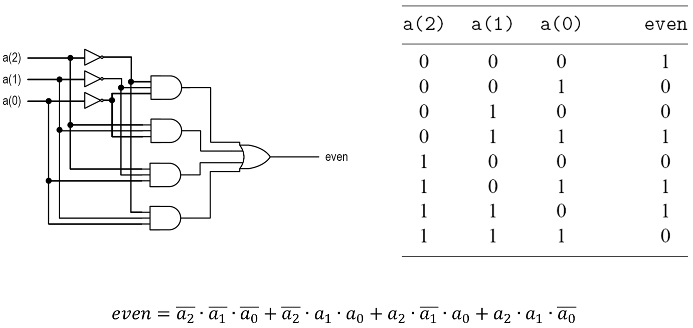
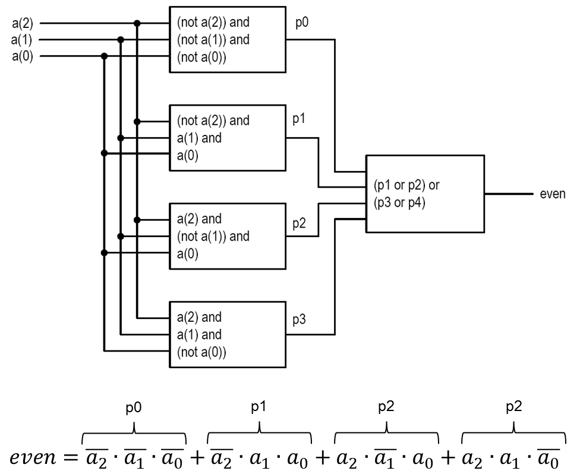
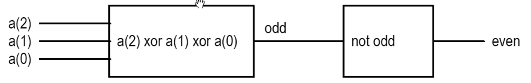
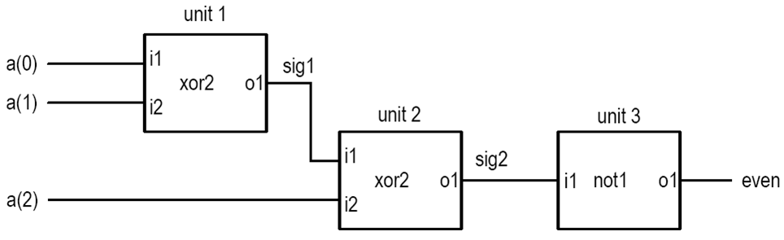
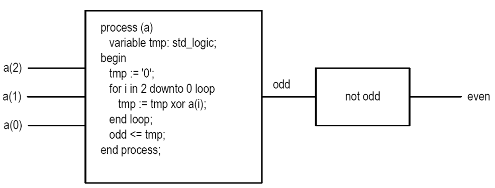
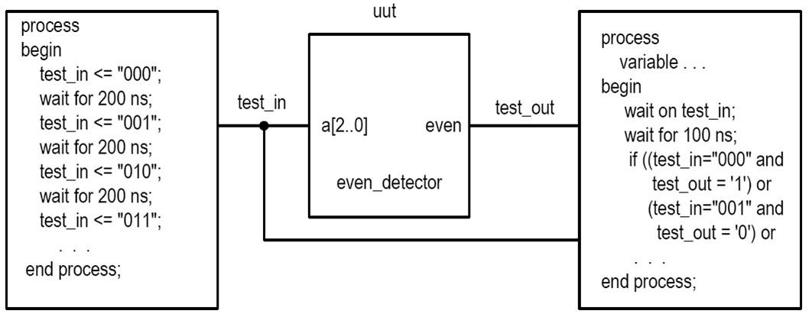
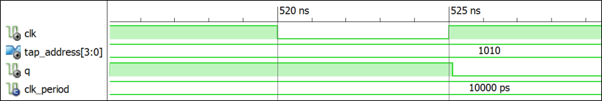

# ECE383 - Embedded Systems II

## HDL Overview


## Lesson Outline

1. Overview of HDLs
2. Basic VHDL concepts by example
3. HDL Synthesis


# Overview of HDLs


## Programming Languages

- Can we use C or Java as an HDL?
- A computer programming language:
  - Semantics ("meaning")
  - Syntax ("grammar")
- Development of a Language
  - Study the characteristics of the underlying processes
  - Develop syntactic constructs and their associated semantics to model and express these characteristics


## HDL vs Traditional PL

- Traditional PL
  - Modeled after a sequential process
  - Operations performed in a sequential order
  - Help human's thinking process to develop an algorithm step-by-step
  - Resemble the operation of a basic computer model
- HDL
  - Characteristics of digital hardware
    - Connections of parts
    - Concurrent operations
    - Concept of propagation delay and timing
  - Characteristics cannot be captured by traditional PLs
  - Require new languages: HDL


## HDL vs Traditional PL

- Structural Connections
- Timing
- Parallel Nature


## Modern Use of HDLs

- Formal Documentation
- Input to a simulator
- Input to a synthesizer


## Characteristics of an HDL

- Capture characteristics of a digital circuit:
  - _Entity_ - basic building block (e.g. 7400 chips)
  - _Connectivity_ - Connection of entities (e.g. wires)
  - _Concurrency_ - parallel operations
  - _Timing_ - schedule / order of multiple operations
- Must be able to describe a circuit in
  - Gate level and RT level
  - Structural view and behavioral view (*not* physical)


## Highlights of Modern HDLs

- Encapsulate the concepts of entity, connectivity, concurrency, and timing
- Incorporate propagation delay and timing information
- Consist of constructs for structural implementation
- Incorporate constructs for behavioral description (sequential execution of traditional PL)
- Describe the operations and structures in gate level and RT level
- Consist of constructs to support hierarchical design process


## Industry-Standard HDLs

- VHDL
  - DoD initiative in 1980s
  - Transferred to IEEE to standardize
  - First released in 1987
  - Similar to Ada
  - Heavily used in FPGA industry
  - New versions: 1993, 2001, 2008
- Verilog
  - Developed by industry
  - Released in early 1980s
  - Similar to C
  - Heavily used in ASIC industry
  - New versions: 1995, 2001, 2005
  - SystemVerilog is a superset of Verilog 2005


# Basic VHDL Concepts By Example


## Even Parity Detection Circuit

- Inputs: a(2 downto 0)
- Output: even




## Even Parity Detection Circuit

```vhdl
library ieee;
use ieee.std_logic_1164.all;

entity even_detector is
  port(
    a     :   in std_logic_vector(2 downto 0);
    even  :   out std_logic
  );
end even_detector;

architecture sop_arch of even_detector is
  signal p1, p2, p3, p4 : std_logic;
begin
  even <= (p1 or p2) or (p3 or p4) after 20 ns;
  p1 <= (not a(2)) and (not a(1)) and (not a(0)) after 15 ns;
  p2 <= (not a(2)) and a(1) and a(0) after 12 ns;
  p3 <= a(2) and (not a(1)) and a(0) after 12 ns;
  p4 <= a(2) and a(1) and (not a(0)) after 12 ns;
end sop_arch;
```


## VHDL Conceptual Diagram




## Alternative Implementation

- Same entity declaration
- VHDL now contains _two_ architecture bodies (`sop_arch` is in the "...")
- Implicit delta delay

```vhdl
library ieee;
use ieee.std_logic_1164_all;
...
architecture xor_arch of even_detector is
  signal odd : std_logic;
begin
  even <= not odd;
  odd <= a(2) xor a(1) xor a(0);
end xor_arch;
```




## Structural Description

- Circuit is constructed by smaller parts
- Specify the types of parts and connections
- Textual description of a schematic
- Done by using "component" in VHDL
  - First _declared_ (made known)
  - Then _instantiated_ (used)




## Even Detector Structural Description

```vhdl
architecture str_arch of even_detector is
  component xor2
    port( i1, i2: in std_logic;
          o1:     out std_logic);
  end component;
  component not1
    port( i1:     in std_logic;
          o1:     out std_logic);
  end component;
  signal sig1, sig2: std_logic;
begin
  unit1: xor2
    port map(i1 => a(0), i2 => a(1), o1 => sig1);
  unit2: xor2
    port map(i1 => a(2), i2 => sig1, o1 => sig2);
  unit3: not1
    port map(i1 => sig2, o1 => even);
end str_arch;
```

**Note:** `xor2` and `not1` must be defined in an imported library.


## Even Detector Behavioral Description

```vhdl
architecture beh1_arch of
even_detector is
  signal odd: std_logic;
begin
  even <= not odd;
  process (a)
    variable tmp: std_logic;
  begin
    tmp := '0';
    for i in 2 downto 0 loop
      tmp := tmp xor a(i);
    end loop;
    odd <= tmp;
  end process;
end beh1_arch;
```

**Note:** "behavioral" in VHDL is anything that is not structural.


## Even Detector Behavioral Description




## Testbench

- A virtual experiment to test functionality of an architecture
- Input stimuli, monitor output

**Note:** See Listing 2.7 (page 35) for example testbench code.




## VHDL Configuration

- Multiple architecture bodies can be associated with an entity declaration
- VHDL _configuration_ specifies the _binding_
- VHDL 1993 provides a shortcut (Lesson 6)

```vhdl
configuration demo_config of even_detector_testbench is
  for tb_arch
    for uut: even_detector
      use entity work.even_detector(sop_arch);
    end for;
  end for;
end demo_config;
```


# HDL Synthesis


## Simulation of VHDL Code

- Design realized in a virtual environment (simulation software)
- All VHDL language constructs can be realized _in simulation_
- Simulation is executed by sampling circuit using small time steps (user configurable)




## HDL Synthesis

- Design realized by hardware components
- Many VHDL constructs cannot be synthesized (e.g. file operation, floating point data type, division)
- Only small subset can be used for synthesis

- Syntactically correct code **is not necessarily** synthesizable code
- Synthesizable code **is not necessarily** efficient code

- Synthesis software only performs transformation and local optimization


## HDL Synthesis

- The course focuses on hardware, **not** VHDL (i.e. the "H", not the "L" of HDL)
- Emphasis on coding for synthesis:
  - Code accurately describing the underlying hardware structure
  - Code providing adequate info to guide synthesis software to generate efficient implementation

| | System Model | RTL Model |
| :-: | :-: | :-: |
| NAND Equivalents | 40,000 | 1200 |
| Ports | 546 | 146 |
| Clock Cycles | N/A | 8 |
| Registers | 0 | 19 |

**Synthesis of Dot Product of Two Vectors**
