# ECE383 - Embedded Systems II

## PicoBlaze and HW/SW Partitioning


# Lesson Outline

- Software on an FPGA
- PicoBlaze Overview
- HW and SW Partitioning


# Software on an FPGA


## Software on an FPGA

- Types of CPUs
  - Hard Core CPU - CPU is custom built/fabricated on the same die as the FPGA.
  - Soft Core CPU - CPU is built with CLBs and other standard FPGA components
  - Xilinx
    - PicoBlaze (8-bit Soft-Core CPU)
    - MicroBlaze (32-bit Soft-Core CPU)
    - PowerPC (32-bit Hard/Soft-Core CPU)
    - ARM (32-bit Hard/Soft-Core CPU)
  - Altera
    - Nios II (32-bit Soft-Core CPU)
- Connect CPU to your custom hardware through I/O (memory mapped or port mapped)


## Software Development

- Write/Test/Debug software on PC using vendor-provided development tools.
- HDL Simulation to test software and hardware interfaces
- Compile/Assemble code and store in program memory accessible from FPGA

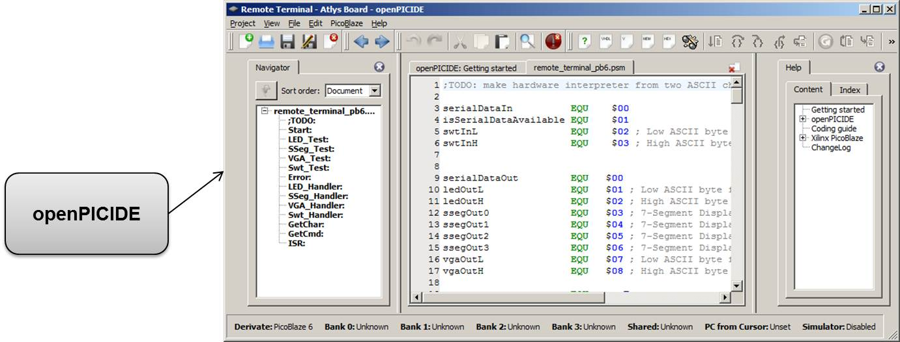


# PicoBlaze Overview


## PicoBlaze Overview

- 8-Bit Xilinx Microprocessor
- 26 Spartan-6 Slices
  - Can use lots of PicoBlaze cores in a single design!
- Up to 4096 instructions (configurable)
- 105 MHz on Spartan 6 (-2)
- 52 - 119 MIPS
- Can go to "sleep"


## PicoBlaze Overview

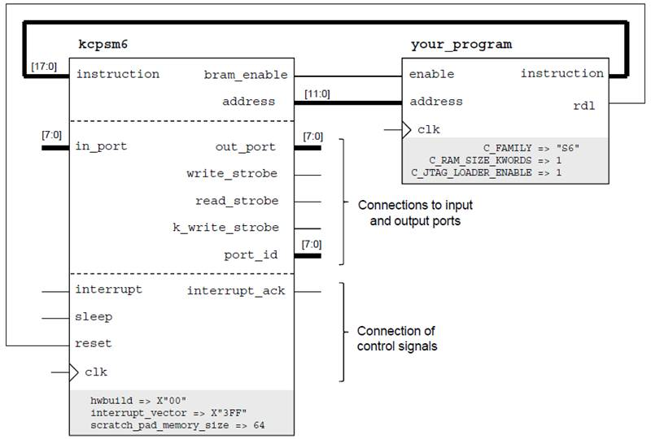


## PicoBlaze on Spartan 3E-500

- Less than 1% utilization

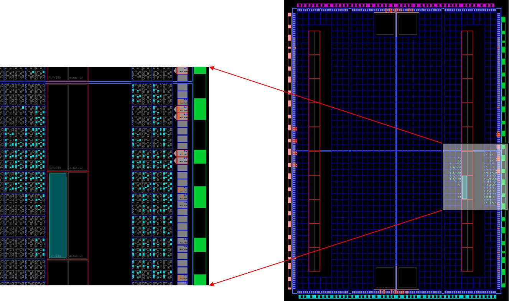


## PicoBlaze Feature Set (KCPSM6)

- 16 General Purpose registers (s0 through sF)
- All instructions under all conditions execute in exactly 2 clock cycles
- 8-bit ALU
  - load, add, subtract, xor, and, compare, test, etc.
  - zero and carry flags
- reset returns processor to initial state except for register contents
- 64, 128, or 256 byte general purpose memory (fetch/store register contents)
- Capable of handling a single external interrupt


## PicoBlaze Feature Set (KCPSM6)

- The next few slides are extracted from the manual
- Read the manual!  Some "goodies" include:
  - Sample VHDL code for input/output ports
  - Detailed port descriptions
  - Detailed description of assembly instructions
  - Example assembly code


## PicoBlaze Architecture (KCPSM6)

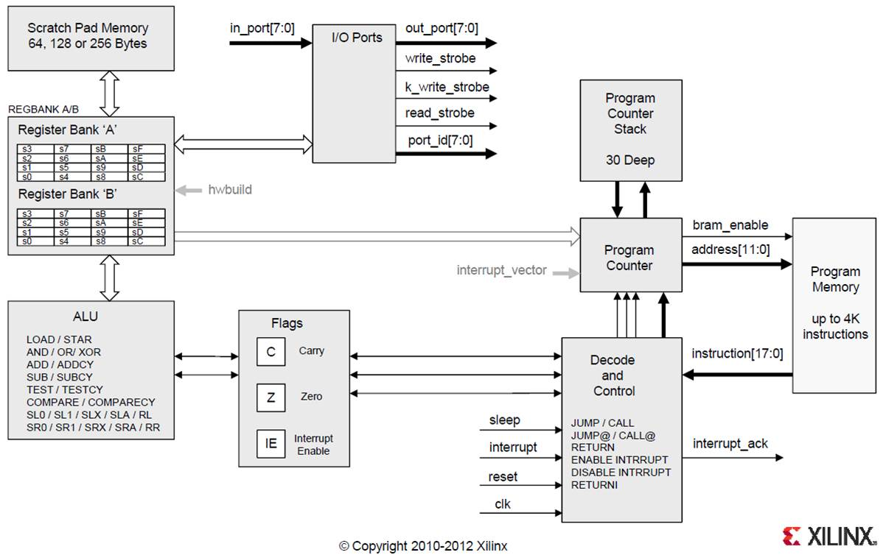


## Read and Write Strobes (KCPSM6)

- 256 input ports, 256 output ports
  - `read_strobe` - high for one clock cycle after data read in
  - `write_strobe` - high for one clock cycle after data written out

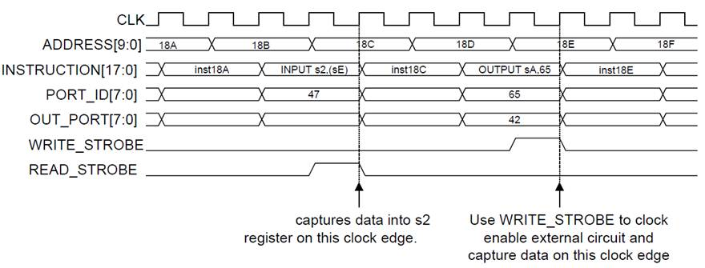


## Design of Output Ports (KCPSM6)

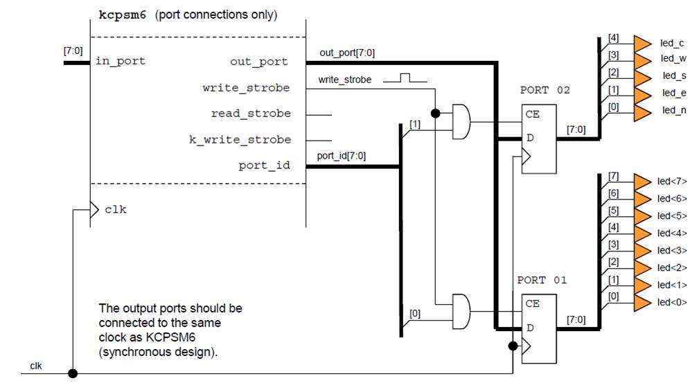


## Design of Input Ports (KCPSM6)

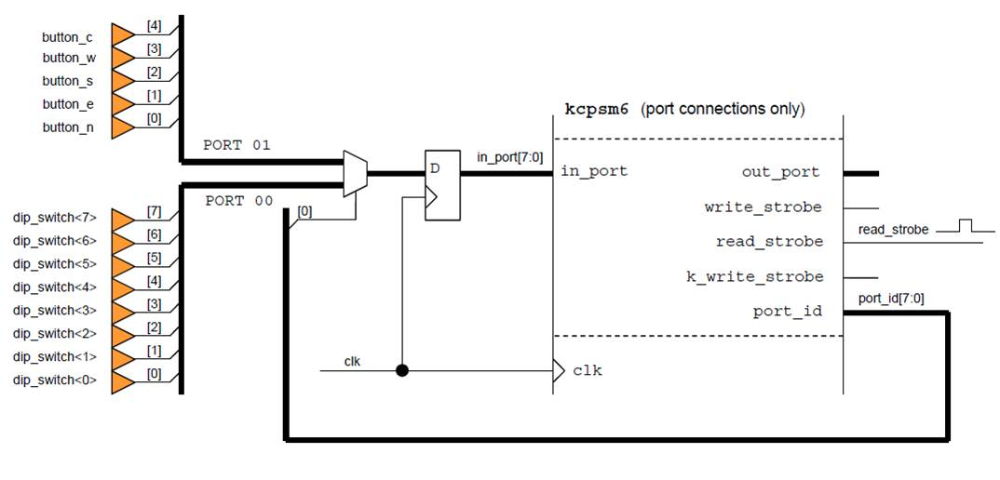


## Assembly Instructions

- ADD, ADDC
- AND
- CALL
- COMP
- IN
- JUMP [C, NC, Z, NZ]
- LOAD
- OR
- OUT
- RET [C, NC, Z, NZ]
- RETI [ENABLE, DISABLE]
- STORE
- SUB, SUBC
- TEST


## Assembly Instructions

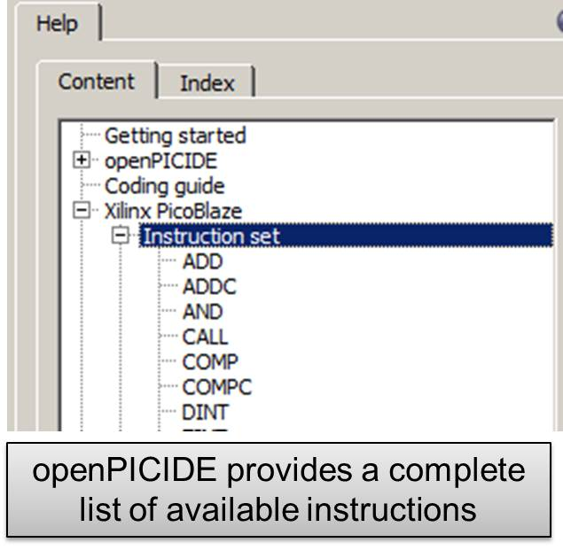


## PicoBlaze Example

```asm
switches_port EQU $AF  ; input
led_port      EQU $07  ; output
temp          EQU s0   ; temporary register

Main: IN      temp, switches_port
      OUT     temp, led_port
      JUMP    Main                 ; labels are case sensitive

ISR:  RETI    ENABLE

ORG   0x3FF
      JUMP     ISR
```

How do we simulate the software?  Hardware?


## openPICIDE Configuration

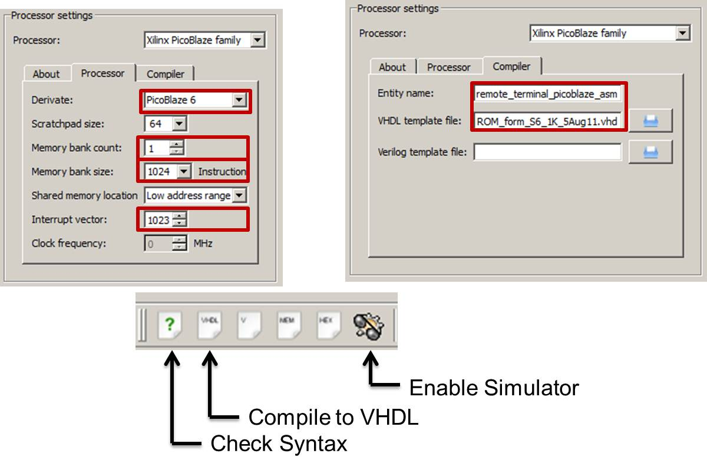


## Hardware Simulation

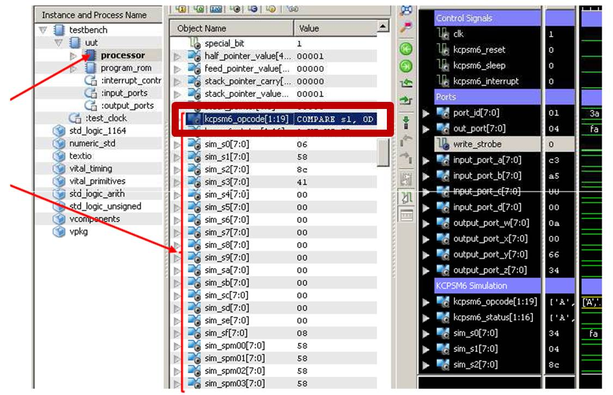

In hardware simulation, you can even view the opcode in plain text!


## Hardware Simulation

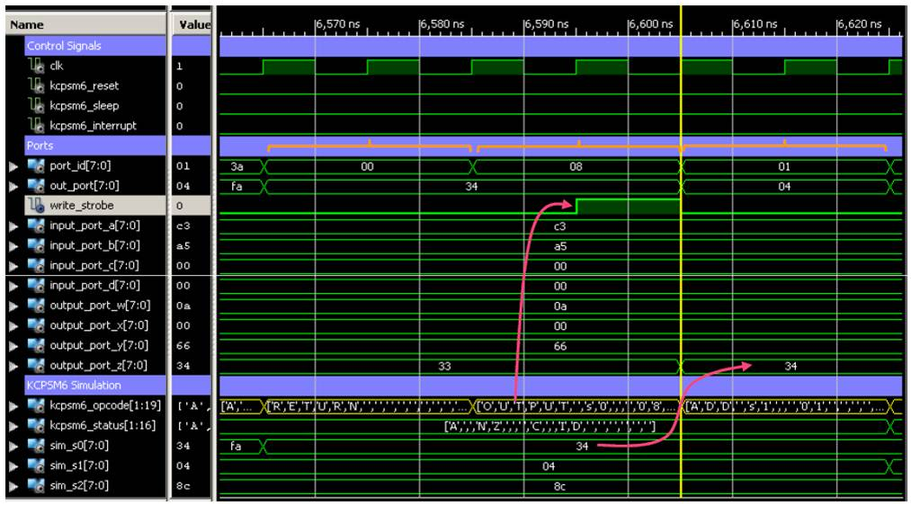


## PicoBlaze Development Process

- Software: Write assembly code in openPICIDE
  - Simulate code to verify it works correctly, in software
  - Generate VHDL ROM file for hardware design
- Hardware: Implement design using VHDL
  - Instantiate the KCPSM6 module
  - Instantiate your generated ROM module
  - Connect signals, as needed
    - Input/Output ports
    - Between the ROM and KCPSM6

Iterate through this process a few times.  Start simple!


# HW and SW Partitioning


## Dividing Between HW and SW

- Partitioning - Grouping of specific sets of instructions in an application and then mapping those groups to either hardware or software.
- Profile - collect run-time information on an application during execution for a given set of inputs.
  - Type of information collected
    - Execution time
    - Resource usage (CPU cycles, memory, hardware, etc.)
  - Variety of tools available
    - `gprof` - Unix command-line tool
    - `time` - Unix command-line tool
    - `tic/toc` - MATLAB command-line tool


## Decomposition Steps

- Decompose the problem and draw a hierarchy of components
- If possible, profile a pure software implementation
  - Group components into individual functions
  - Find the "bottleneck" functions and attempt to parallelize
- Divide components into hardware and software implementation categories
  - Hardware (expensive to develop/test, great area/power/speed)
    - Hard area/power/speed requirements
    - Inherently parallel problem
  - Software (cheap to develop/test, poor area/power/speed)
    - Sequential algorithms
    - Non-time critical complex state machines
    - Anything not implemented in hardware!


## Amdahl's Law

- Important equation for computer architecture
- Applies law of diminishing returns to the usefulness of a single architecture feature

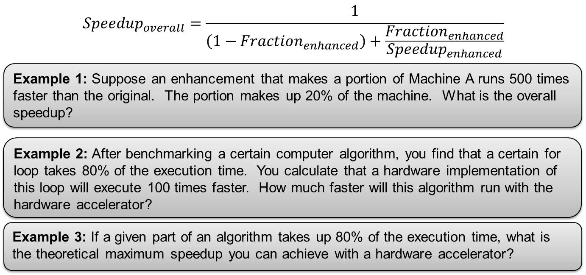


## Decomposing Problem (Asteroids Game)

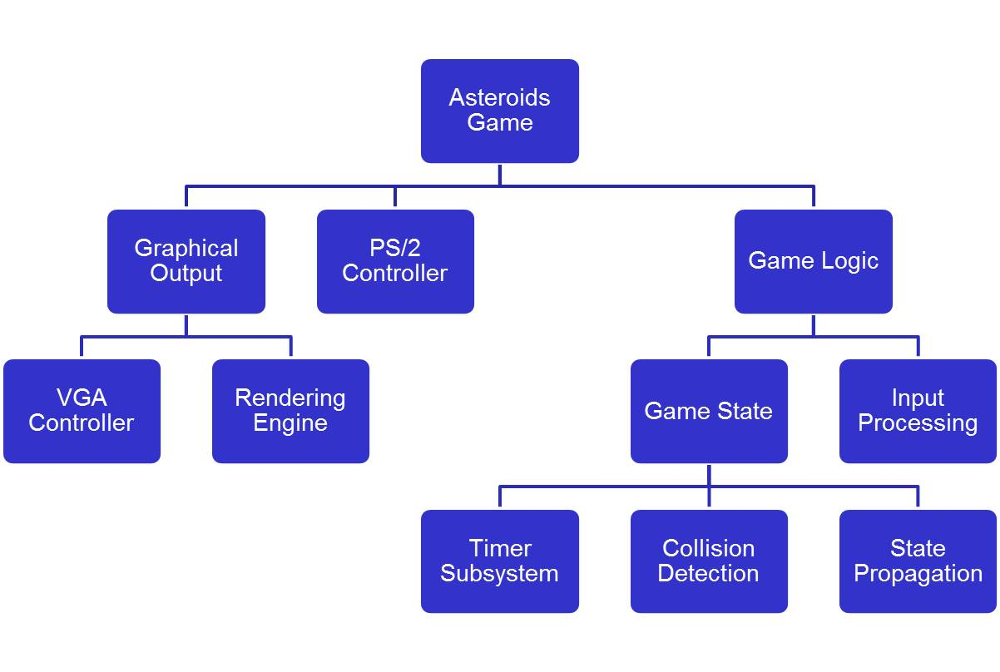
