# ECE383 - Embedded Systems II

## FPGA Design for Area, Power, or Speed

# Lesson Outline

- Xilinx FPGA Architecture
- Optimizing for Area
- Optimizing for Power
- Optimizing for Speed

## Documentation

- Most of the images and notes in this presentation are taken from:
  - [Xilinx University Program](http://www.xilinx.com/support/university/index.htm)
  - [Xilinx Online FPGA Design
    Training](http://www.xilinx.com/training/interactive-online-fpga-training.htm)

# Xilinx FPGA Architecture

## Xilinx FPGA Architecture - Overview

- Modern FPGA's contain hardware-dedicated resources for commonly used functions.
- Improves performance
- Reduces area and power use
- 7-Series Architecture Features
  - Logic ("FPGA Fabric")
  - Interconnect
  - Block/Distributed RAM
  - SelectIO/CMT
  - DSP Slices
  - Serial Transceiver

## Xilinx FPGA Architecture - Overview

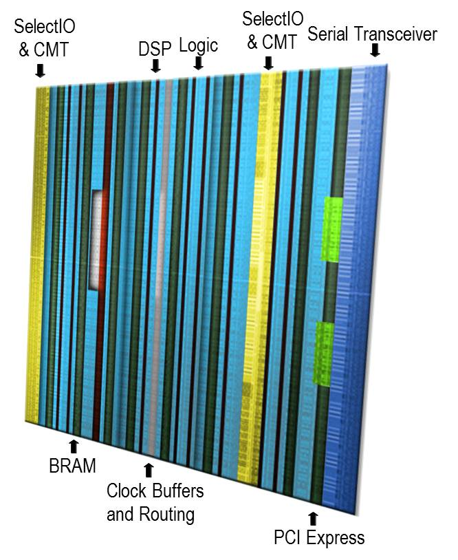

## Xilinx FPGA Architecture - CLB Structure

- Two side-by-side slices per CLB
  - Slice_M are memory-capable
  - Slice_L are logic and carry only
- Four 6-input LUTs per slice
  - Consistent with previous architectures
  - Single LUT in Slice_M can be a 32-bit shift register or 64 x 1 RAM (Distributed RAM)
- Two flip-flops per LUT

## Xilinx FPGA Architecture - CLB Structure

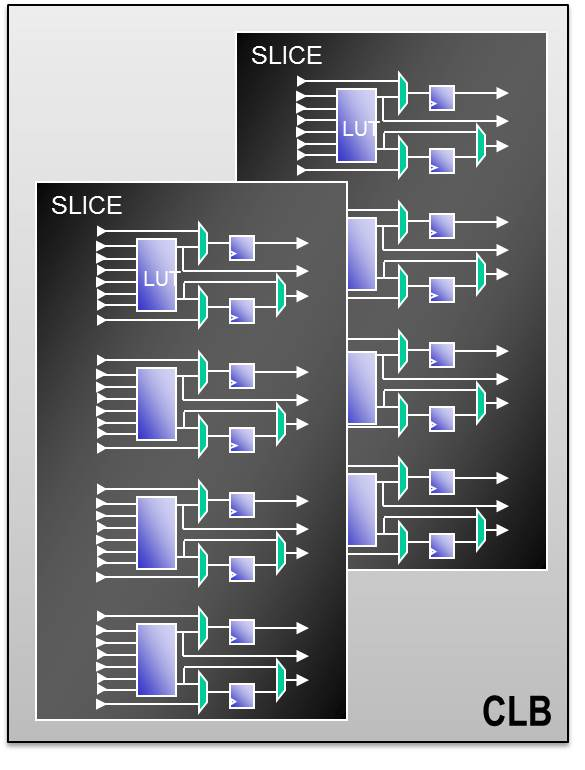

## Xilinx FPGA Architecture - Slice Structure

- Local routing provides connection between slices in the same CLB, and it provides routing to neighboring CLBs
- Carry logic runs vertically, between slices and CLBs
- Other resources on slice:
  - LUTs
  - MUXs with dedicated routing
  - Carry Logic
  - Sequential Elements

## Xilinx FPGA Architecture - Slice Structure

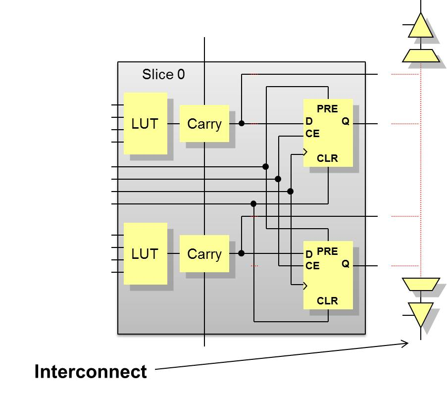

## Xilinx FPGA Architecture - Block RAM

- Synchronous read and write capability
- True dual-port memory
- Supports initial values and parity bits
- 36K/18K block RAM

## Xilinx FPGA Architecture - Block RAM

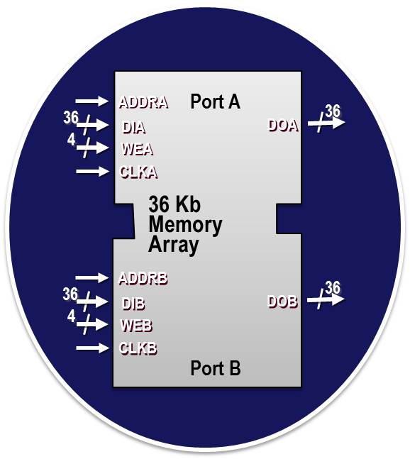

## Xilinx FPGA Architecture - Distributed RAM

- Synchronous write
- Asynchronous read - but can be made into synchronous read
- RAM/ROM are initialized during configuration - data can be written to RAM after configuration
- Emulated dual-port RAM
  - One read/write port
  - One read-only port
- Implemented using LUTs

## Xilinx FPGA Architecture - Distributed RAM

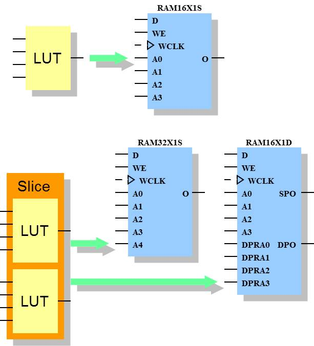

## Xilinx 7-Series Architecture - Input / Output Blocks (SelectIO)

- Supports dozens of IO standards
  - Single (PCI, CMOS, TTL, I2C, etc.)
  - Differential (TMDS, Display Port, etc.)
  - Tri-state buffers
  - Double Data Rate
  - Registered I/O
  - Various Voltage levels

## Xilinx 7-Series Architecture - Input / Output Blocks (SelectIO)

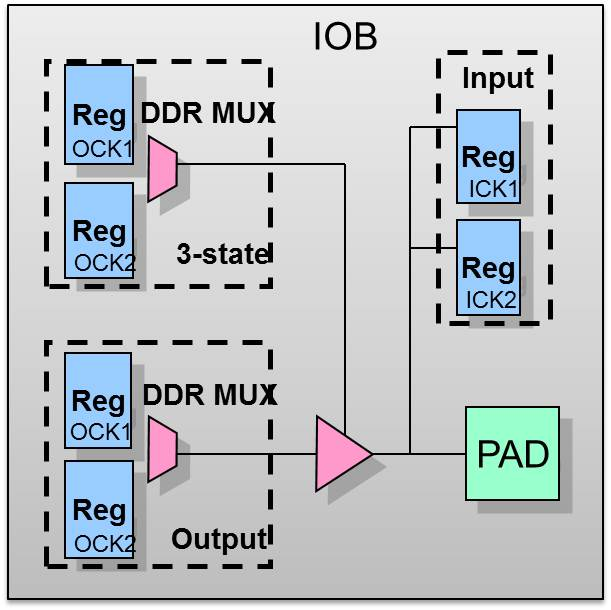

## Xilinx FPGA Architecture - CMT/DCM

- **Former**: Digital Clock Manager (DCM)
- **Current**: Clock Management Tile (CMT)
- **Purpose**:
  - Reduce clock skew through feedback (PLL/DLL)
  - Generate new frequencies that are a multiple/divisor of current frequency (e.g. clk*4/8)
  - Phase shift clock
  - Dedicated routing to all flip flops in within clock region to minimize clock skew

## Xilinx FPGA Architecture - CMT/DCM

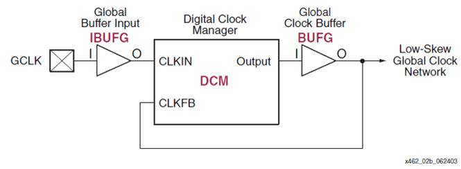

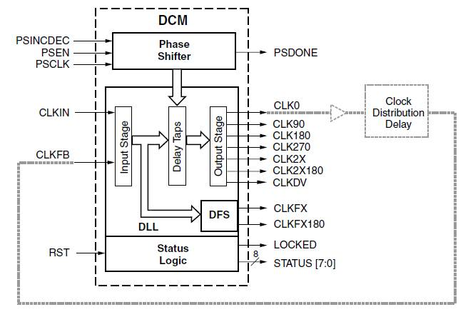

## Xilinx FPGA Architecture - DSP Slice

- 7-Series Architecture DSP Slice Features:
  - 25x18 multiplier
  - 25-bit pre-adder
  - Flexible pipeline
  - Cascade in and out
  - Carry in and out
  - 96-bit MACC
  - SIMD support
  - 48-bit ALU
  - Pattern detect
  - 17-bit shifter
  - Dynamic operation (cycle by cycle)

## Xilinx FPGA Architecture - DSP Slice

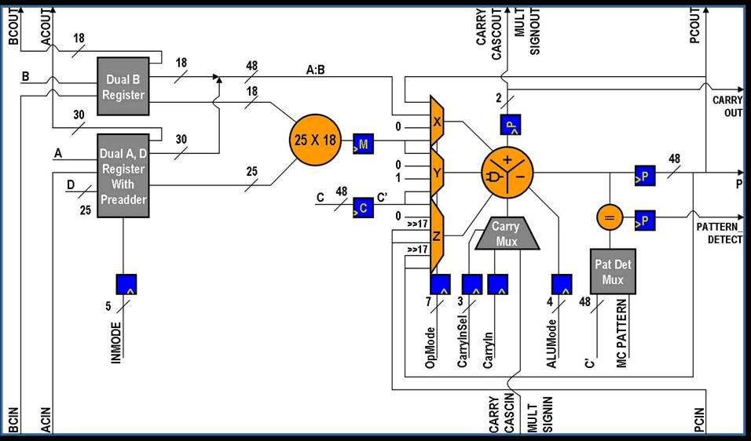

# Optimizing for Area

## Optimizing for Area

- Use RTL design methodology
- Use dedicated hardware when available (e.g., block RAM, multipliers, DSP, SERDES I/O, etc.)
- Pay attention to synthesizer messages (e.g., could not infer block/distributed RAM due to a coding style mistake)
- "Optimize for Area" during synthesis and implementation
  - Resource Sharing
  - Use IOB’s registers
  - Combine LUTs
- "Optimize for Area" when using CoreGen tools
- Use resets only when necessary, use synchronous resets

# Optimizing for Power

## Optimizing for Power

- Minimize your dynamic power (see below equation)
  - Turn off parts of FPGA that aren’t in use
  - Block RAM
- Use the Chip Enable signals for flip-flops
- Use Xilinx tools to estimate power usage for various settings
- “Optimize for Power” during synthesis and implementation
- “Optimize for Power” when using CoreGen tools
- Use resets only when necessary, use synchronous resets

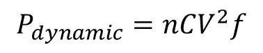

- `n` = number of toggling nodes
- `C` = capacitance
- `V` = voltage swing
- `f` = toggle frequency

## Optimizing for Power

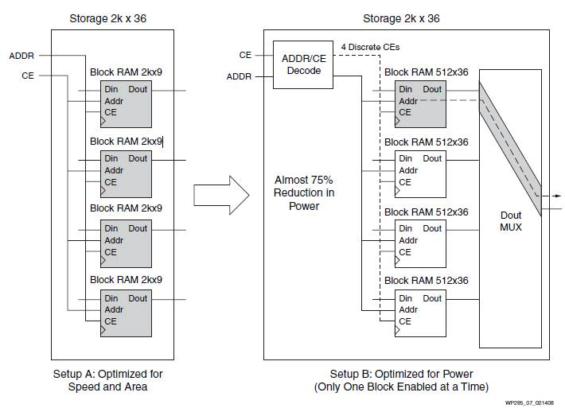

# Optimizing for Speed

## Optimizing for Speed - Use Global Timing Constraints

- Without global timing constraints
  - Logic tends to be grouped to improve internal timing at the expense of I/O timing

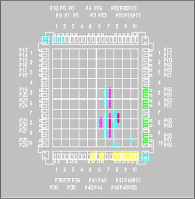

## Optimizing for Speed - Use Global Timing Constraints

- With global timing constraints
  - All timing paths are evaluated
  - I/O paths are improved (CLBs are place closer to I/O pins)

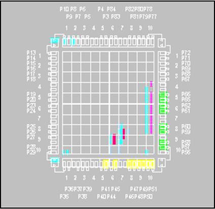

## Optimzing for Speed - Logic Levels and Delay

- Enter your timing constraints into the Xilinx Constraints File
- Over-constraining does not help you, but it will take longer to implement (if it can implement)
- Review the timing reports after synthesis and implementation to see details (max clock speed, longest path, etc.)
- Path endpoints are:
  - I/O Pads
  - Synchronous elements (FFs, Latches, RAMs, DSP slices, SRLs, etc.)
  - NOT: LUTs, Nets, or any other asynchronous element
- Global timing constraints will cover 90% of the timing constraints you need to deal with.
- You can specify net-specific constraints, but that is beyond the scope of this class

## Optimizing for Speed - Timing Constraints

- The combination of the interconnect and the LUT forms a logic level
- Lower speed grade devices operate slower (longer LUT delays)
- 50/50 rule is typically used – 50% of delay is from LUT, 50% from routing delay
- Make your designs _parallel_ - cascading logic (e.g., priority multiplexer) significantly slows down your design
- _Pipeline_ your design to reduce longest path and therefore increase maximum clock speed.

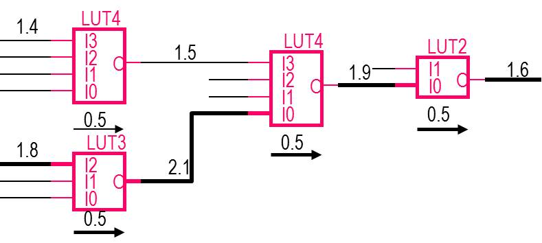

## Optimizing for Speed - PERIOD Constraint

- The PERIOD constraint covers paths between synchronous elements on a single clock domain
  - In this example, there is one clock signal (CLK)
  - There are five synchronous elements (all FFs) attach to the clock which means there are five path endpoints, in this case
  - There are three delay paths constrained between those five FFs

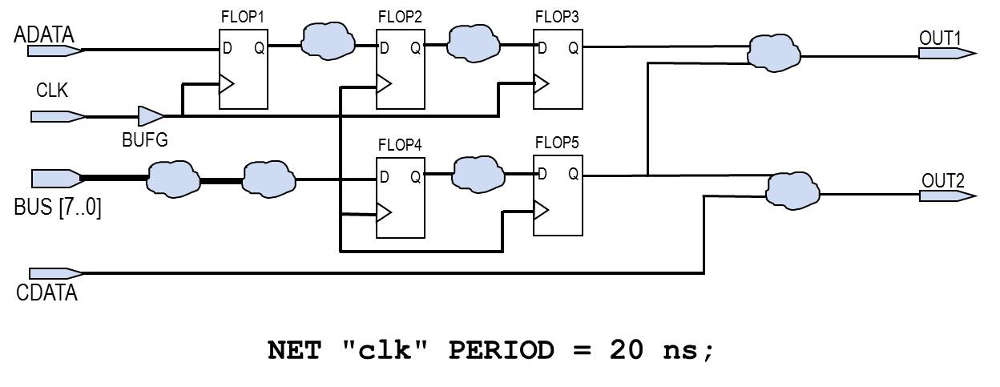

## Optimizing for Speed - OFFSET IN/OUT Constraints

- The OFFSET IN constraint covers paths from input pads to synchronous elements
- The OFFSET OUT constraint covers paths from synchronous elements to input pads

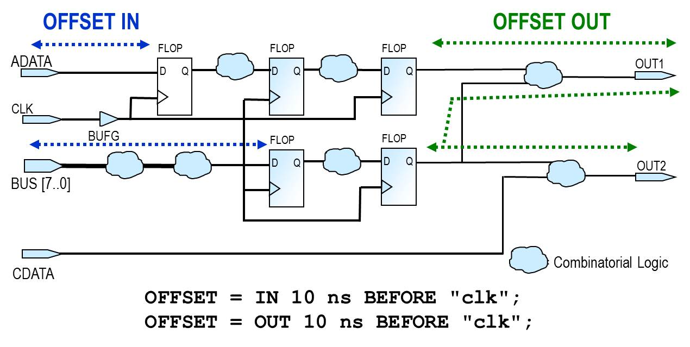
