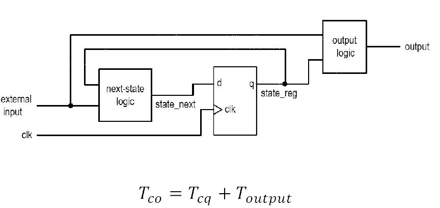

# ECE383 - Embedded Systems II

## Timing Analysis

# Lesson Outline

- Combinational Timing Considerations
- Sequential Timing Analysis
- Synthesis Guidelines

# Combinational Timing Considerations

## Combinational Timing Considerations

- Propagation delay
- Synthesis with timing constraint
- Hazards
- Delay-sensitive design

## Propagation Delay - Overview

- *Delay* - time required to propagate a signal from an input port to a output port
- *Cell-level delay* - most accurate
- The impact of wire becomes more dominant
- Delay components:
  - Time required for transistors to change state
  - Output impedance of an individual cell
  - Summation of parasitic capacitances of wires and input capacitances for load cells

## Propagation Delay - Overview

## Propagation Delay - System Delay

- *System Delay* - the longest path (input to output) in the system
- *False path* - a path along which a signal cannot actually propagate
- Difficult if the design is mainly "random" logic
- Critical path can be identified if many complex operators (such as adders or multipliers) are used in the design.

## Propagation Delay - System Delay

## Synthesis with Timing Constraint

- Multi-level synthesis is flexible
- It is possible to reduce by delay by adding extra logic
- Synthesis with timingconstraint:
  1. Obtain the minimal-area implementation
  2. Identify the critical path
  3. Reduce the delay by adding extra logic
  4. Repeat 2 & 3 until meeting the constraint

## Synthesis with Timing Constraint

## Synthesis with Timing Constraint

Area-Delay Trade-Off Curve

## Synthesis with Timing Constraint

Writing better RTL code

## Timing Hazards

- *Propagation delay* - time to obtain a stable output
- *Hazards* - the fluctuation occurring during the transient period
  - *Static hazard* - glitch when the signal should be stable
  - *Dynamic hazard* - a glitch in transition
- Due to the multiple converging paths of an output port

## Timing Hazards - Static Hazard

## Timing Hazards - Dynamic Hazard

## Timing Hazards - Dealing with Hazards

- Some hazards can be eliminated in theory (e.g. use redundant K-map terms)
  - Eliminating glitches is very difficult in reality, and almost impossible for synthesis
  - Multiple inputs can change simultaneously (e.g. 1111 -> 0000 in a counter)
  - During logic synthesis, the logic expressions will be rearranged and optimized
  - During technology mapping, generic gates will be re-mapped
  - During placement & routing, wire delays may change

## Timing Hazards - Dealing with Hazards

- How to deal with it?
  - Ignore glitches in the transient period and retrieve the data after the signal is stabilized
  - Synchronous Design! - but now we have to deal with setup and hold time constraints

# Sequential Timing Analysis

## Sequential Timing Analysis

- *Combinational Circuit* - characterized by propagation delay
- *Sequential Circuit*
  - Has to satisfy setup/hold time constraints
  - Characterized by maximal clock rate (e.g. 200 MHz Counter, 3.4 GHz Intel Core i7)
  - Embedded in clock rate
    - Setup time
    - clock-to-Q delay of a register
    - Propagation delay of next-state logic

## Sequential Timing Analysis - Setup Time Violation

## Sequential Timing Analysis - Setup Time Violation Consequences

## Sequential Timing Analysis - Shift Register Example

## Sequential Timing Analysis - Hold Time Violation

We don't worry about hold time reqmts unless clock edge does not arrive at all FFs at same time

## Sequential Timing Analysis - Output Delay

# Synthesis Guidelines

## Synthesis Guidelines

- Strictly follow the synchronous design methodology (i.e. all registers in a system should be synchronized by a common clock signal)
- Isolate the memory components from the VHDL description and code them in a separate segment.  One-segment coding style is not advisable
- The memory components should be coded clearly so that a predesigned cell can be inferred from the device library
- Avoid synthesizing a memory component from scratch
- Asynchronous reset, if used, should be only for system initialization.  It should not be used to clear the registers during regular operation
- Unless there is a compelling reason, a variable should not be used to infer a memory component
