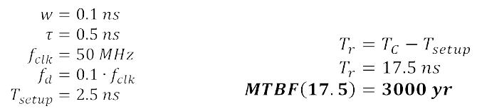
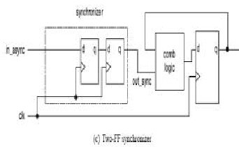

# ECE383 - Embedded Systems II

## Clock and Synchronization

# Lesson Outline

- Clock Distribution Network and Skew
- Multiple Clock System
- Metastability and Synchronization Failure
- Synchronization
- Synthesis Guidelines

# Clock Distribution Network and Skew

## Clock Distribution Network

- *Ideal clock* - clock's rising edges arrive at FFs at the same time
- Real implementation
  - Driving capability of each cell is limited
  - Need a network of buffers to drive all FFs b/c of fan out
  - In ASIC: done by clock synthesis (a step in physical synthesis)
  - In FPGA: pre-fabricated clock distribution network

## Clock Distribution Network

## Clock Skew

- *Skew* - time difference between two arriving clock edges

## Timing Analysis

**Clock skew actually helps increase clock rate in this case**

## Timing Analysis

- If the clock signal travels from the opposite direction:

  
  - Now the clock skewdecreasesthe maximum clock rate
  - Normally we have to consider the worst case since:
    - No control on clock routing during synthesis
    - Multiple feedback paths
- Hold time constraint

  
  - Skew may reduce hold time margin
  - Hold time violation cannot be corrected in RTL design

## Clock Skew Summary

- Clock skew normally has negative impact on a synchronous sequential circuit
- Effect on setup time constraint - required to increase clock period (i.e. reduce clock frequency)
- Effect on hold time constraint - may introduce hold-time violation which can only be fixed during physical synthesis:
  - re-route clock
  - re-place register and combinational logic
  - add artificial delay logic
- Skew within 10% of clock period is usually tolerable

# Multiple Clock System

## Why Multiple Clocks?

- Inherent multiple clock sources (e.g. external communication link)
- Circuit size
  - Clock skew increases with the number of FFs in a system
  - Current technology can support up to 10,000 FFs
- Design complexity - e.g. a system w/16-bit 20MHz processor, 1-bit 100MHz serial interface, 1 MHz I/O controller
- Power consideration - dynamic power is proportional to switching frequency

## Derived vs. Independent Clocks

- Independent clocks - relationship between the clocks is unknown
- Derived clocks - relationship is known
  - Clock is derived from another clock (e.g. different clock rate or phase)
  - Logic for the derived clock should be separated from regular logic and manually synthesized (e.g. special delay line or PLL)
  - System with derived clock can still be treated and analyzed as a synchronous system
- Globally Asynchronous Locally Synchronous System (GALS)
  - Partition a system into multiple clock domains
  - Design and verify subsystem in same clock domain as a synchronous system
  - Design special interface between clock domains

# Metastability and Synchronization Failure

## Timing Analysis of a Synchronous System

- Signal from the state register
  - Controlled by the clock
  - Adjust clock period to avoid setup time violation
- Signal from external input
  - Same if the external input comes from another synchronous subsystem
  - Otherwise, have to deal with the occurrence of setup time violation

## Metastability

- What happens after timing violation?
  - Output of FF become 1 (sampled old input value)
  - Output becomes 0 (sampled new input value)
  - FF enters metastable state, the output exhibits an "in-between" value
    - FF eventually "resolves" to one of the stable states
    - The resolution time is a random variable with distribution function (is a decay constant)
    
    - The probability that metastability persists beyond is MTBF

## Metastability

## Mean Time Between Synchronization Failures (MTBF)

- Synchronization Failure - a FF cannot resolve the metastable condition within the given time
- MTBF
  - Mean Time Between synchronization Failures
  - Basic criterion for metastability analysis
  - Frequently expressed as a function of  (resolution time provided)

## Mean Time Between Synchronization Failures (MTBF)

## MTBF Example

## MTBF Observations

- MTBF is a statistical average
- Only  can be adjusted in a practical design
- MTBF is extremely sensitive to 
  - Good - synchronization failure can easily be avoided by providing additional resolution time
  - Bad - minor mod can introduce synchronization failure

# Synchronization

## Synchronization Circuit

- Synchronize an asynchronous input with system clock
- No physical circuit can prevent metastability
- Synchronizer just provides enough time for the metastable condition to be "resolved"
- Example:

## Synchronization Circuit

## Synchronization Circuit - No Synchronizer

## Synchronization Circuit - One-FF Synchronizer

## Synchronization Circuit - Two-FF Synchronizer

## Synchronization Circuit - Three-FF Synchronizer

## Why is Synchronization a "Tricky" Issue?

- Metastability is basically an "analog" phenomena
- Metastability behavior is described by a random variable
- Metastability cannot be easily modeled or simulated in gate level (only 'X')
- Metastability cannot be easily observed or measured in a physical circuit (e.g. MTBF = 3 months)
- MTBF is very sensitive to circuit revision (combinational and routing delays)

## Synchronization Methods

**Sharing Data Across Clock Domains**

- *FIFO* - synchronization is needed for empty and full status signals
- *Shared Memory* - synchronization needed for arbitration circuit
- *Dual-Port Memory* - meta-stable condition may occur in the internal arbitration circuit

# Synthesis Guidelines

## Synthesis Guidelines

**Section 9.5**

- Asynchronous reset, if used, should be only for system initialization.  It should not be used to clear the registers during regular system operation
- Do not manipulate or gate the clock signal.  Most desired operations can be achieved by using a register with an enable signal
- LFSR is an effective way to construct a counter.  It can be used when the counting patterns are not important
- Throughput and delay are two performance criteria.  Adding a pipeline to a combinational circuit can increase the throughput but not reduce the delay
- The main task of adding a pipeline to acombinatioralcircuit is to divide the circuit into balanced stages.  Software with retiming capability can aid in this task

## Synthesis Guidelines

**Section 16.11 - Use of a Clock**

- Do Not manipulate the clock signal in regular RTL design and synthesis
- Minimize the number of clock signals in a system
- Minimize the number of clock domains (i.e. the number of independent clock signals).  Use a derived clock signal when possible
- If a derived clock signal is needed, manually derive and instantiate the circuit and separate it from the regular synthesis

## Synthesis Guidelines

**Section 16.11 - Synchronizer Guidelines**

- Synchronize a signal in a single place
- Avoid synchronizing related signals
- Use a glitch-free signal for synchronization
- Reanalyze and examine the synchronizer and MTBF when the device is changed or the clock rate is revised

## Synthesis Guidelines

**Section 16.11 - Interface Between Clock Domains**

- Clearly identify the boundary of the clock domain and the signals that cross the domain
- Separate the synchronization circuits and asynchronous interface from the synchronous subsystems, and instantiate them as individual modules
- Use a reliable synchronizer design to provide sufficient metastability resolution time
- Analyze the data transfer protocol over a wide range of scenarios, including faster and slower clock frequencies and different data rates
