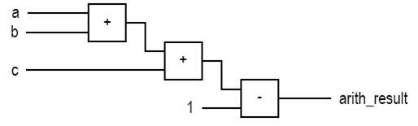
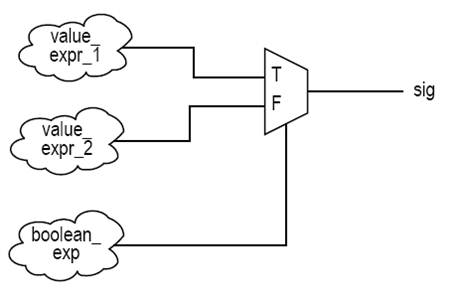
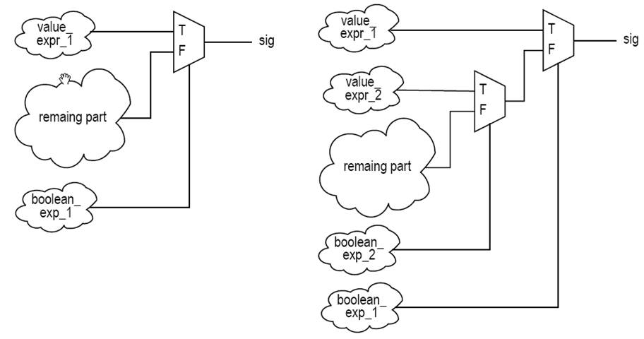
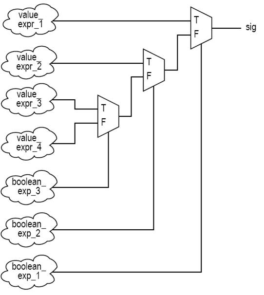
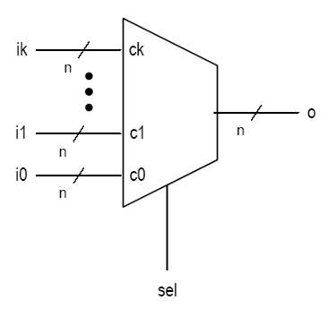
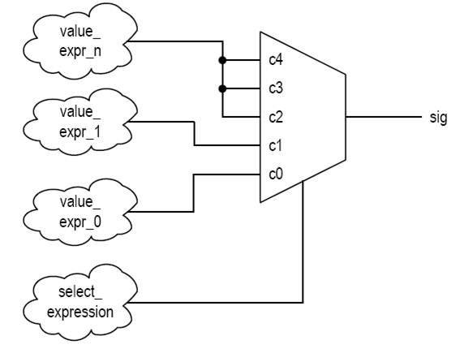

# ECE383 - Embedded Systems II

## Combinational Circuits in VHDL


# Lesson Outline

- Combinational vs Sequential Circuits
- Simple Signal Assignment
- Conditional Signal Assignment
- Selected Signal Assignment
- Conditional vs Selected Signal Assignment


# Combinational vs Sequential Circuits


## Combinational vs Sequential Circuits

- Combinational circuit:
  - No internal state
  - Output is a function of inputs only
  - No latches / FFs or closed feedback loop
- Sequential circuit:
  - Has internal state
  - Output is a function of inputs and internal state
- Sequential circuits to be discussed later


# Simple Signal Assignment


## Simple Signal Assignment

- Simple signal assignment is a special case of conditional signal assignment
- Syntax:
  - `signal_name <= projected_waveform;`
  - `y <= a + b + 1 after 10 ns;`
- Timing info ignored in synthesis and delta-delay used:
  - `signal_name <= value_expression;`


## Simple Signal Assignment

- Example simple signal assignments:
  - `status <= '1';`
  - `even <= (p1 and p2) or (p3 and p4);`
  - `arith_out <= a + b + c -1;`
- Implementation of last statment:




## BAD: Simple Assignment with Closed Feedback Loop

- A signal appears in both sides of a concurrent assignment statement:
  - `q <= ((not q) and (not en)) or (d and end);`
- Syntactically correct
- Forms a closed feedback loop (i.e. infinite loop)
- Should be avoided


# Conditional Signal Assignment


## Conditional Signal Assignment

- Syntax
- Examples
- Conceptual implementation

```vhdl
signal_name
  <=  value_expr_1 when boolean_expr_1 else
      value_expr_2 when boolean_expr_2 else
      value_expr_3 when boolean_expr_3 else
      ...
      value_expr_n;
```


## Example: 4-to-1 Multiplexer

```vhdl
library ieee;
use ieee.std_logic_1164.all;

entity mux4 is
  port(
    a,b,c,d : in std_logic_vector(7 downto 0);
    s       : in std_logic_vector(1 downto 0);
    x       : out std_logic_vector(7 downto 0)
  );
end mux4;

architecture cond_arch of mux_4 is
begin
  x <=  a when (s="00") else
        b when (s="01") else
        c when (s="10") else
        d;
end cond_arch;
```


## Example: 2-to-4 Binary Decoder

```vhdl
libary ieee;
use ieee.std_logic_1164.all

entity decoder4 is
  port(
    s : in std_logic_vector(1 downto 0);
    x : out std_logic_vector(3 downto 0)
  );
end decoder4;

architecture cond_arch of decoder4 is
begin
  x <=  "0001" when (s="00") else
        "0010" when (s="01") else
        "0100" when (s="10") else
        "1000";
end cond_arch;
```


## Conceptual Implementation

- Syntax:

```vhdl
signal_name
  <=  value_expr_1 when boolean_expr_1 else
      value_expr_2 when boolean_expr_2 else
      value_expr_3 when boolean_expr_3 else
      ...
      value_expr_n;
```

- Evaluation in ascending order
- Achieved by "priority-routing network"
- Top value expression has a higher priority


## 2-to-1 Mux Implementation

```vhdl
signal_name <=  value_expr_1 when boolean_expr_1 else
                value_expr_2;
```




## Cascaded Mux Implementation

```vhdl
signal_name <=  value_expr_1 when boolean_expr_1 else
                value_expr_2 when boolean_expr_2 else
                value_expr_3 when boolean_expr_3 else
                value_expr_4;
```




## Cascaded Mux Implementation




# Selected Signal Assignment


## Selected Signal Assignment

- Syntax
- Examples
- Conceptual implementation

```vhdl
with select_expression select
  sig_name <= expr_1 when choice_1,
              expr_2 when choice_2,
              expr_3 when choice_3,
              ...
              expr_n when choice_n;
```


## Example: 4-to-1 Multiplexer

```vhdl
architecture sel_arch of mux4 is
begin
  with s select
    x <=  a when "00",
          b when "01",
          c when "10",
          d when others;
end sel_arch;
```

**Question:** Can `when "11"` be used to replace the `when others` statement?


## Example: 2-to-4 Decoder

```vhdl
architecture sel_arch of dec4
begin
  with s select
    x <=  "0001" when "00",
          "0010" when "01",
          "0100" when "10",
          "1000" when others;
end sel_arch;
```


## Example: Simple ALU

```vhdl
architecture sel_arch of simple_alu is
  signal sum  : std_logic_vector(7 downto 0);
  signal diff : std_logic_vector(7 downto 0);
  signal inc  : std_logic_vector(7 downto 0);
begin
  inc   <= std_logic_vector(
            signed(src0) + 1 );
  sum   <= std_logic_vector(
            signed(src0) + signed(src1) );
  diff  <= std_logic_vector(
            signed(src0) - signed(src1) );
  when ctrl select
    result <= inc when "000"|"001"|"010"|"011",
              sum when "100",
              diff when "101",
              src0 and src1 when "110",
              src0 or src1 when others; -- "111"
end sel_arch;
```

**Question:** Can `"0--"` be used to replace the first statement?


## Conceptual Implementation

- Achieved by a multiplexing circuit
- Abstract (k+1)-to-1 multiplexer
  - `sel` is with a data type of (k+1) values:
    - `c0, c1, c2,..., ck`
- `select_expression` is with a data type of 5 values: `c0, c1, c2, c3, c4`

```vhdl
with select_expression select
  sig <=  value_expr_0 when c0,
          value_expr_1 when c1,
          value_expr_n when others;
```




## Conceptual Implementation




# Conditional vs Selected Signal Assignment


## Conditional vs Selected Signal Assignment

- Conversion between conditional vs selected signal assignment
- Comparison


## Conversion: Selected -> Conditional

```vhdl
with sel select
  sig <=  value_expr_0 when c0,
          value_expr_1 when c1|c3|c5,
          value_expr_2 when c2|c4,
          value_expr_n when others;
```

```vhdl
sig <=
  value_expr_0 when (sel=c0) else
  value_expr_1 when (sel=c1) or (sel=c3) or (sel=c5) else
  value_expr_2 when (sel=c2) or (sel=c4) else value_expr_n;
```


## Conversion: Conditional -> Selected

```vhdl
sig <=  value_expr_0 when bool_expr_0 else
        value_expr_1 when bool_expr_1 else
        value_expr_2 when bool_expr_2 else
        value_expr_n;
```
```vhdl
sel(2) <= '1' when bool_expr_0 else '0';
sel(1) <= '1' when bool_expr_1 else '0';
sel(0) <= '1' when bool_expr_2 else '0';

with sel select
  sig <=  value_expr_0 when "100"|"101"|"110"|"111",
          value_expr_1 when "010"|"011",
          value_expr_2 when "001",
          value_expr_n when others;
```


## Conditional vs Selected Comparison

- Selected signal assignment:
  - Good match for a circuit described by a functional table
  - Example: binary decoder, multiplexer
  - Less effective if input pattern is not given a preferential treatment
- Conditional signal assignment:
  - Good match for a circuit that needs to give preferential treatment for certain conditions or to prioritize operatoins
  - Example: priority encoder
  - May "over-specify" for a functional table based circuit
  - Can handle complicated conditions

```vhdl
pc_next <=
  pc_reg + offset when (state=jump and a=b) else
  pc_reg + 1 when (state=skip and flag='1') else
  ...
```


# Synthesis Guidelines


## Synthesis Guidelines

- Avoid a closed feedback loop in a concurrent signal assignment statement
- Think of the conditional signal assignment and selected signal assignment statements as routing structures rather than sequential control constructs
- The conditional signal assignment statement infers a priority routing structure, and a larger number of `when` clauses leads to a long cascading chain
- The selected signal assignment statement infers a multiplexing structure, and a large number of choices leads to a wide multiplexer
