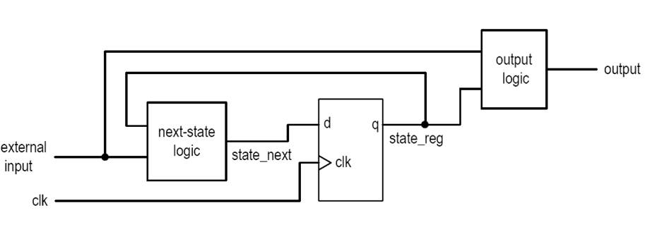
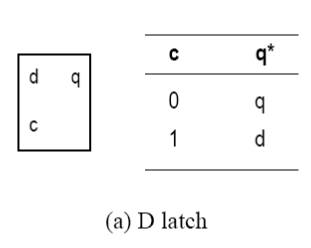
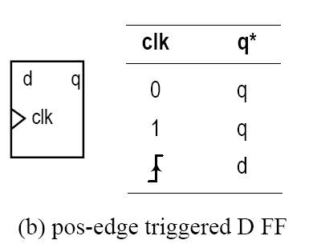
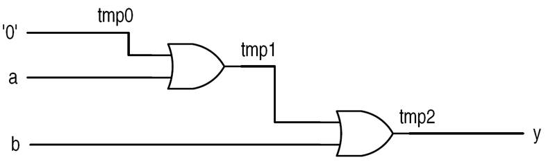
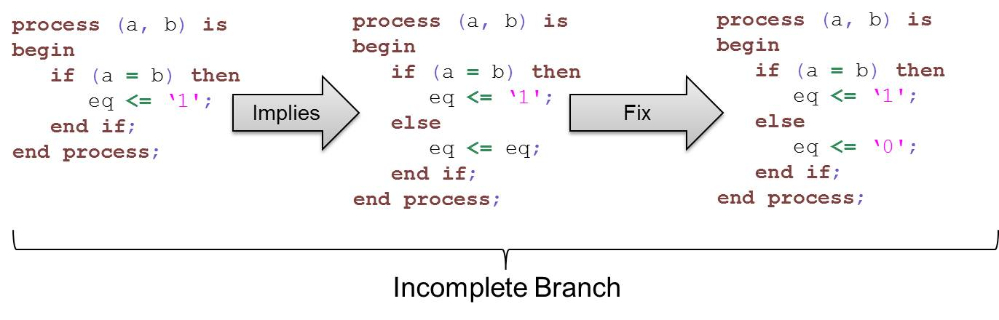
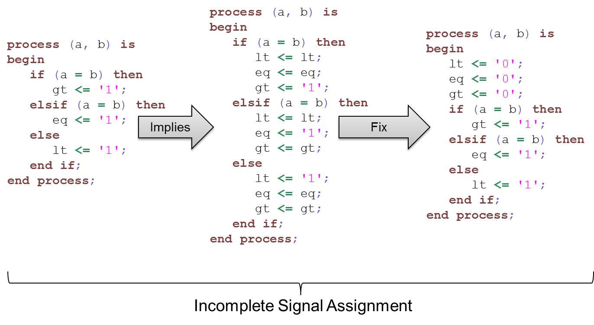
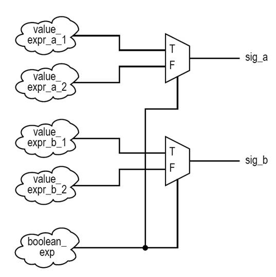
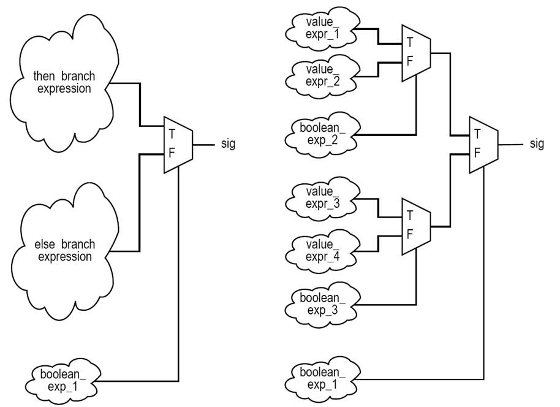
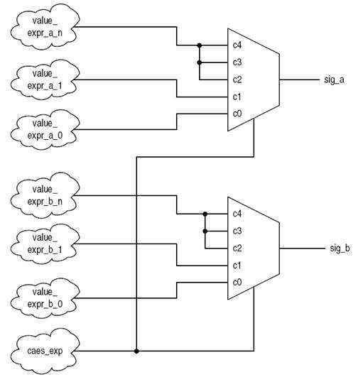

# ECE383 - Embedded Systems II

## Sequential Circuits in VHDL


# Lesson Outline

- VHDL `process`
- Synchronous Circuits (Chapter 8)
- Sequential Signal Assignment Statement
- Variable Assignment Statement
- `if` Statement
- `case` Statement
- Simple `for` Loop Statement


# VHDL `process`


## VHDL `process`

- Contains a set of sequential statements to be executed sequentially
- The whole `process` is a concurrent statement
- Can be interpreted as a circuit part enclosed inside of a black box
- May or may not be able to be mapped to physical hardware
- Two types of `process` statements:
  - A `process` with a sensitivity list
  - A `process` with a `wait` statement


## VHDL `process` with Sensitivity List

- A process is like a circuit part, which can be:
  - active (known as _activated_)
  - inactive (known as _suspended_)
- A process is activated when a signal in the sensitivity list changes its value
- Its statements will be executed sequentially until the end of the process
- For a combinational circuit, _all inputs_ should be included in the sensitivity list

```vhdl
process (sensitivity_list) is
  declarations;
begin
  sequential statement;
  sequential statement;
  ...
end process;
```

```vhdl
process (a, b, c) is
begin
  y <= a and b and c;
end process;
```


## VHDL `process` With `wait` Statement

- Process has no sensitivity list
- Process continues the execution until a `wait` statement is reached and then suspended
- Forms of `wait` statement:
  - `wait on signals;`
  - `wait until boolean_expression;`
  - `wait for time_expression;`
- A process can have multiple `wait` statments
- **Process with sensitivity list is preferred for synthesis**

```vhdl
process is
begin
  y <= a and b and c;
  wait on a, b, c;
end process;
```


# Synchronous Circuits (Chapter 8)


## Synchronous Circuits (Chapter 8)

- One of the most difficult design aspects of a sequential circuit: **how to satisfy timing constraints**
- The Big Idea
  - Group all DFFs together with a single clock: synchronous methodology
  - Only need to deal with the timing constraint of **one** memory element


## Synchronous Circuits (Chapter 8)

- Basic block diagram
  - State register (memory elements)
  - Next-state logic (combinational circuit)
  - Output logic (combinational circuit)
- Operation
  - At the rising edge of the clock, `state_next` sampled and stored into the register (and becomes the new value of `state_reg`)
  - The next-state logic determines the new value (new `state_next`) and the output logic generates the output
  - At the rising edge of the clock, the new value of `state_next` sampled and stored into the register
- Glitches have no effect as long as the `state_next` is stable at the sampling edge




## D Latch

```vhdl
process (c, d, q_latch) is
begin
  if (c = '1') then
    q_latch <= d;
  else
    q_latch <= q_latch;
  end if;
  q <= q_latch;
end process;
```




## D Flip Flop

```vhdl
process (clk) is
begin
  if (reset = '1') then
    q <= '0';
  elsif rising_edge(clk) then
    q <= d;
  end if;
end process;

process (clk) is
begin
  if (reset = '1') then
    q <= '0';
  elsif falling_edge(clk) then
    q <= d;
  end if;
end process;
```

**Note:** You can use `std_logic_vector` for `d` and `q`.




# Sequential Signal Assignment Statement


## Simple Signal Assignment

- Syntax:
  - `signal_name <= value_expression;`
- Syntax is identical to the simple concurrent signal assignment
- Caution: inside a process, a signal can be assigned multiple times, but only _the last assignment takes effect_
- A signal can only be set in _one_ process or combinational statement

```vhdl
process (a, b, c, d) is
begin
  y <= a or c;
  y <= a and b;
  y <= c and d;
end process;
```
**is equivalent to:**
```vhdl
process (a, b, c, d) is
begin
  y <= c and d;
end process;
```

What would happen if the three statements were concurrent statements?


# Variable Assignment Statement


## Variable Assignment Statement

- Syntax:
  - `variable_name := value_expression;`
- Assignment takes effect immediately
- No time dimension (i.e. no delay)
- Behave like variables in C
- Difficult to map to hardware (depending on context)

```vhdl
process (a, b, c) is 
  variable tmp : std_logic;
begin
  tmp := '0';
  tmp := tmp or a;
  tmp := tmp or b;
  y <= tmp;
end process;
```




# `if` Statement


# `if` Statement

- Syntax
- Examples
- Comparison to conditional signal assignment
- Incomplete branch and incomplete signal assignment
- Conceptual implementation:

```vhdl
if bool_expr_1 then
  sequential_statements;
elsif bool_expr_2 then
  sequential_statements;
...
else
  sequential_statements;
end if;
```


## 4-to-1 Multiplexer

```vhdl
architecture if_arch of mux4 is
begin
  process (a, b, c, d, s) is
  begin
    if (s = "00") then
      x <= a;
    elsif (s = "01") then
      x <= b;
    elsif (s = "10") then
      x <= c;
    else
      x <= d;
    end if;
  end process;
end if_arch;
```


## Comparison to Conditional Signal Assignment

- Two statements are the same if there is only one output signal in an `if` statement
- `if` statement is more flexible
- Sequential statements can be used in `then`, `elsif`, and `else` branchs:
  - Multiple statements
  - Nested `if` statements


## Incomplete Branch and Incomplete Signal Assignment

- According to VHDL definition:
  - Only the `then` branch is required; `elsif` and `else` branches are optional
  - Signals do not need to be assigned in all branches
  - When a signal is unassigned due to omission, it keeps the "previous value" (implying "memory" - Latch / FF)




## Incomplete Branch and Incomplete Signal Assignment




## Conceptual Implementation

- Same as conditional signal assignment statement if the `if` statement consists of:
  - One output signal
  - One sequential signal assignment in each branch
- Multiple sequential statements can be constructed recursively

```vhdl
if (boolean_expr) then
  sig_a <= value_expr_a_1;
  sig_b <= value_expr_b_1;
else
  sig_a <= value_expr_a_2;
  sig_b <= value_expr_b_2;
end if;
```




## Conceptual Implementation

```vhdl
if (boolean_expr_1) then
  if (boolean_expr_2) then
    sig <= value_expr_1;
  else
    sig <= value_expr_2;
  end if;
else
  if (boolean_expr_3) then
    sig <= value_expr_3;
  else
    sig <= value_expr_4;
  end if;
end if;
```




# `case` Statement


## `case` Statement

- Syntax
- Examples
- Comparison to selected signal assignment statement
- Incomplete signal assignment
- Conceptual implementation

```vhdl
case case_expr is
  when choice_1 =>
    sequential_statements;
  ...
  when choice_n =>
    sequential_statements;
end case;
```


## 4-to-1 Multiplexer

```vhdl
architecture case_arch of mux4 is
begin
  process (a, b, c, d, s) is
  begin
    case s is
      when "00" =>
        x <= a;
      when "00" =>
        x <= b;
      when "00" =>
        x <= c;
      when others =>
        x <= d;
    end case;
  end process;
end case_arch;
```


## Comparison to Selected Signal Assignment

- Two statements are the same if there is only one output signal in `case` statement
- `case` statement is more flexible
- Sequential statements can be used in choice branches

```vhdl
with sel_expr select
  sig <=  value_expr_1 when choice_1,
          value_expr_2 when choice_2,
          ...
          value_expr_n when choice_n;
```

```vhdl
case sel_expr is
  when choice_1 =>
    sig <= value_expr_1;
  when choice_2 =>
    sig <= value_expr_2;
  ...
  when choice_n =>
    sig <= value_expr_n;
end case;
```


## Incomplete Signal Assignment

- According to VHDL definition:
  - Signals do not need to be assigned in all choice branches
  - When a signal is unassigned, it keeps the "previous value" (implying "memory")

**Note:** This is nearly identical to the issue with incomplete signal assignment for `if` statements.  See that slide for description of problem and how to fix it.


## Conceptual Implementation

- Same as selected signal assignment statement if the `case` statement consists of
  - One output signal
  - One sequential signal assignment in each branch
- Multiple sequential statements can be constructed recursively

```vhdl
case case_exp is
  when c0 =>
    sig_a <= value_expr_a_0;
    sig_b <= value_expr_b_0;
  when c1 =>
    sig_a <= value_expr_a_1;
    sig_b <= value_expr_b_1;
  when others =>
    sig_a <= value_expr_a_n;
    sig_b <= value_expr_b_n;
end case;
```




# Simple `for` Loop Statement


## Simple `for` Loop Statement

- Syntax
  - VHDL provides a variety of loop constructs
  - Only a restricted form of loop can be synthesized
  - `loop_range` must be static
  - `index` assumes value of `loop_range` from left to right
- Examples
- Conceptual implementation

```vhdl
for index in loop_range loop
  sequential_statements;
end loop;
```


## Reduced `xor` Example

```vhdl
library ieee;
use ieee.std_logic_1164.all;

entity reduced_xor_demo is
  port(
    a : in std_logic_vector(3 downto 0);
    y : out std_logic
  );
end reduced_xor_demo;

architecture demo_arch of reduced_xor_demo is
  constant WIDTH : integer := 4;
  signal tmp : std_logic_vector(WIDTH-1 downto 0);
begin
  process (a, tmp) is
  begin
    tmp(0) <= a(0); -- Boundary bit
    for i in 1 to (WIDTH-1) loop
      tmp(i) <= a(i) xor tmp(i-1);
    end loop;
  end process;
  y <= tmp(WIDTH-1);
end demo_arch;
```


## Conceptual Implementation

- "Unroll" the loop
- `for` loop should be treated as "shorthand" for repetitive statements
- Previous example: reduced `xor`

```vhdl
tmp(0) <= a(0);
...
temp(1) <= a(1) xor tmp(0);
temp(2) <= a(2) xor tmp(1);
temp(3) <= a(3) xor tmp(2);
...
y <= tmp(3);
```


# Synthesis Guidelines


## Synthesis of Sequential Statements

- Concurrent statements
  - Modeled after hardware
  - Have clear, direct mapping to physical structures
- Sequential statements
  - Intended to describe "behavior"
  - Flexible and versatile
  - Can be difficult to be realized in hardware
  - Can be easily abused
- Think hardware
- Designing hardware is not converting a C program to a VHDL program


## Synthesis Guidelines: Sequential Statements

- Variables should be used with care
  - A signal is greatly preferred
  - A statement like `n := n + 1;` can cause great confusion for synthesis
- Except for the default value, avoid overriding a signal multiple times in a process
- Think of the `if` and `case` statements as routing structures rather than sequential control constructs
- An `if` statement infers a priority routing structure, and a larger number of `elsif` branches leads to a long cascading chain
- A `case` statement infers a multiplexing structure, and a large number of choices leads to a wide multiplexer
- Think of a `for` loop statement as a mechanism to describe the replicated structure
- Avoid "innovative" use of language constructs
  - We should be innovative about hardware architecture, not description of the architecture
  - Synthesis software may not be able to interpret the intention of the code


## Synthesis Guidelines: Combinational Circuits

- Include all input signals in the sensitivity list to avoid unexpected behavior
- Include all branches of an `if` statement to avoid an unwanted latch
- An output signal should be assigned in every branch of the `if` and `case` statements to avoid an unwanted latch
- It is good practice to assign a default value to each signal at the beginning of the process
