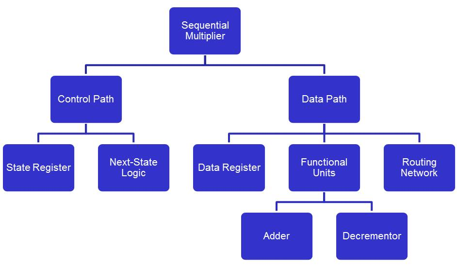
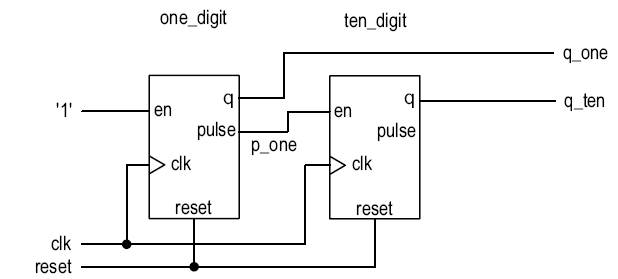
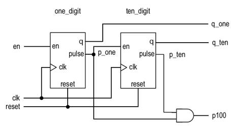
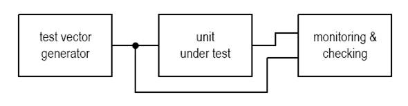

# ECE383 - Embedded Systems II

## Hierarchical and Testable Design in VHDL


# Lesson Outline

- Introduction
- Components
- Generics
- Configuration
- Other Supporting Constructs
- Synthesis Guidelines


# Introduction


# Introduction

- How do you deal with 1 Million gates or more?
- Hierarchical design
  - Divide-and-conquer strategy
  - Divide a system into smaller parts




## Benefits of Hierarchical Design

- Complexity management
  - Focus on a manageable portion of the system, and analyze, design, and verify each module in isolation
  - Construct the system in stages by a designer or concurrently by a team of designers
  - Helps synthesis process
- Design reuse
  - Use predesigned modules or third-party cores
  - Use the same module in different designs
  - Isolate device-dependent components (e.g. SRAM)


## Relevant VHDL Constructs

- Component
- Generic
- Configuration
- Library
- Package
- Subprogram


# Components


## Components

- Hierarchical design usually shown as a block diagram (structural description)
- VHDL component is the mechanism to describe structural description in text
- To use a component:
  - Component declaration (to make known)
    - Instantiate an instance of a component
    - Provide a generic value
    - Map formal signals to actual signals
  - Component instantiation (create an instance)
    - Instantiate an instance of a component
    - Provide a generic value
    - Map formal signals to actual signals


## Components

```vhdl
component component_name
  generic(
    generic_declaration;
    generic_declaration;
  );
  port(
    port_declaration;
    port_declaration;
  );
end component;
```

```vhdl
instance label: component_name
  generic map(
    generic_association;
    generic_association;
  )
  port map(
    port_association;
    port_association;
  );
```


## Components

- Port association (named association - formal to actual parameters)
  - `port_name => signal_name`
- Positional association - order of port declaration in entity
  - Appeared to be less cumbersome
  - Alternative to component instantiation
  - Trouble if the order later changes in entity declaration


## Components

```vhdl
entity dec_counter is
  port(
    clk, reset : in std_logic;
    q : out std_logic_vector(3 downto 0);
    pulse : out std_logic
  );
end dec_counter;
```

```vhdl
-- Before "begin"
component dec_counter is
  port(
    clk, reset : in std_logic;
    q : out std_logic_vector(3 downto 0);
    pulse : out std_logic
  );
end component;
```

```vhdl
-- In the body
one_digit: dec_counter
  port map(
    clk => clk,
    reset => reset,
    q => q_one
  );
```


## Mapping of Constant and Unused Ports

- Good synthesis software should
  - remove the unneeded part
  - perform optimization of constant input

```vhdl
-- In the body

one_digit: dec_counter
  port map(
    clk => clk,
    reset => reset,
    en => '1',        -- constant
    pulse => p_one,
    q => q_one
  );

ten_digit: dec_counter
  port map(
    clk => clk,
    reset => reset,
    en => p_one,
    pulse => open,    -- keyword for unused port
    q => q_one
  );
```


## Mapping of Constant and Unused Ports




# Generics


## Generics

- Mechanism to pass info into an entity / component
- Declared in entity declaration and then can be used as a constant in port declaration and architecture body
- Assigned a value when the component is instantiated
- Like a parameter, but has to be constant
- Can be used in port declaration

```vhdl
entity para_binary_counter is
   generic(WIDTH: natural);
   port(
      clk, reset: in std_logic;
      q: out std_logic_vector(WIDTH-1 downto 0)
   );
end para_binary_counter;

architecture arch of para_binary_counter is
   signal r_reg : unsigned(WIDTH-1 downto 0);
   signal r_next : unsigned(WIDTH-1 downto 0);
begin
   process(clk, reset) is
   begin
      if (reset='1') then
         r_reg <= (others => '0');
      elsif (clk'event and clk='1') then
         r_reg <= r_next;
      end if; end process;
      r_next <= r_reg + 1;
      q <= std_logic_vector(r_reg);
end arch;vhdl
```


## Parameterized mod-n Counter

- Count from 0 to n-1 and wrap around
- Note that WIDTH depends on N

```vhdl
library ieee;
use ieee.std_logic_1164.all;
use ieee.numeric_std.all;
 
entity mod_n_counter is
   generic(
      N: natural;
      WIDTH: natural
   );
   port(
      clk, reset: in std_logic;
      en: in std_logic;
      q: out std_logic_vector(WIDTH-1 downto 0);
      pulse: out std_logic
   );
end mod_n_counter;
```

```vhdl
architecture arch of mod_n_counter is
   signal r_reg: unsigned(WIDTH-1 downto 0);
   signal r_next: unsigned(WIDTH-1 downto 0);
begin
   process(clk,reset) -- register

   begin
      if (reset='1') then
         r_reg <= (others=>'0');
      elsif (clk'event and clk='1') then
         r_reg <= r_next;
      end if;
   end process;
   process(en,r_reg) -- next-state logic
   begin
      r_next <= r_reg;
      if (en='1') then
          if r_reg=(N-1) then
             r_next <= (others=>'0');
          else
             r_next <= r_reg + 1;
          end if;
      end if;
   end process;
   -- output logic
   q <= std_logic_vector(r_reg);
   pulse <= '1' when r_reg=(N-1) else '0';
end arch;
```


## 2-Digit Decimal Counter

```vhdl
one_digit: dec_counter
    generic map( N=>10, WIDTH=>4)
    port map (
        clk=>clk,
        reset=>reset,
        en=>'1',
        pulse=>p_one,
        q=>q_one
    );
ten_digit: dec_counter
    generic map( N=>10, WIDTH=>4)
    port map (
        clk=>clk,
        reset=>reset,
        en=>p_one,
        pulse=>open,
        q=>q_ten
    );
p100 <= p_one and p_ten; 
```




# Configuration


## Configuration

- Bind a component with an entity and an architecture
- Flexible and involved.
- Only simple binding of entity and architecture is needed in synthesis
  - **Entity**: like a socket in a printed circuit board
  - **Architecture**: like an IC chip with same outline
- Not supported by all synthesis software
- Application of binding:
  - Example: adder with different speed: Fast but large adder or small but slow adder
  - Example: Test bench: descriptions at different stages




## Configuration

- Type of configuration:
  - Configuration declaration (an independent design unit)
  - Configuration specification (in architecture body) 
- Default binding: (no configuration)
  - Component bound to an entity with identical name
  - Component ports bound to entity ports of same names
  - Most recently analyzed architecture body bound to the entity
- Configuration declaration
  - An independent design unit
  - Simplified syntax

```vhdl
configuration conf_name of entity_name is
    for architecture_name
        for instance_label: component_name
            use entity lib_name.bount_entity_name(bound_arch_name);
        end for;
        for instance_label: component_name
            use entity lib_name.bount_entity_name(bound_arch_name);
        end for;
        ...
end;
```


## Two Architecture Bodies

- One body for up-counting, one body for down-counting
  - `architecture down_arch of dec_counter is`
- You create a new design unit that specifies how your entity (`hundred_counter`) will map for a given architecture (`vhdl_87_arch`):

```vhdl
configuration count_down_config of hundred_counter is
    for vhdl_87_arch
        for one_digit: dec_counter
            use entity work.dec_counter(down_arch);
        end for;
        for ten_digit: dec_counter
           use entity work.dec_counter(down_arch);
        end for;
end; 
```


## Configuration Specification

- Alternative to creating a new configuration design unit
- Placed in the “declarations” of your structural VHDL architecture body

```vhdl
for instance_label : component_name
    use entity lib_name.bound_entity_name(bound_arch_name);
for instance_label : component_name
    use entity lib_name.bound_entity_name(bound_arch_name);
```

```vhdl
architecture vhdl_93_arch of hundred_counter is
    component dec_counter is
        port(
            clk, reset, en : in std_logic;
            q : out std_logic_vector(3 downto 0);
            pulse : out std_logic
        );
    for one_digit : dec_counter
        use entity work.dec_counter(down_arch);
    for ten_digit : dec_counter
        use entity work.dec_counter(down_arch);
    signal p_one, p_ten : std_logic;
begin
    ... 
```


## VHDL 1993 Shortcut

- Remove component and configuration declaration 
- Usually satisfactory for RT-level synthesis 

```vhdl
instance_label:
    entity lib_name.bound_entity_name(bound_arch_name)
        generic map (...)
        port map (...);
```

```vhdl
architecture vhdl_93_arch of hundred_counter is
    signal p_one, p_ten : std_logic;
begin
    one_digit: entity work.dec_counter(up_arch)
        port map (clk => clk, reset => reset, en => en,
                  pulse => p_one, q => q_one);
    ten_digit: entity work.dec_counter(up_arch)
        port map (clk => clk, reset => reset, en => p_one,
                  pulse => p_ten, q => q_ten);
    p100 <= p_one and p_ten;
end vhdl_93_arch; 
```


# Other Supporting Constructs


## Other Supporting Constructs

- Library
- Subprogram
- Package


## Library

- A virtual repository to stored analyzed design units
- Physical location determined by software
- Design units can be organized and stored in different libraries
- Default library: “work”
- Non-Default library has to be declared (e.g. IEEE)

```vhdl
library ieee;

use entity work.dec_counter(down_arch);
```


## Subprogram

- Include function and procedure
- Made of sequential statement 
- Is not a design unit; must be declared
- Aimed for software hierarchy not hardware hierarchy
- We only use function 
  - Shorthand for complex expression
  - “House-keeping tasks; e.g., type conversion 

```vhdl
function func_name(parameter_list) return data_type is
   declarations;
begin
   sequential statement;
   sequential statement;
   ...
end func_name;
```


## Example Subprogram

```vhdl
function log2c(n: integer) return integer is
  variable m, p: integer;
begin
  m := 0;
  p := 1;
  while p < n loop
    m := m + 1;
    p := p * 2;
  end loop;
  return m;
end log2c;
```


## Package

- Organize and store declaration information, such as data types, functions etc. 
- Divided into
  - Package declaration 
  - Package body (implementation of subprograms)
- Both are design units

```vhdl
package package_name is
   declaration_item;
   declaration_item;
   ...
end package_name;
```

```vhdl
package body package_name is
   subprogram or data type;
   subprogram or data type;
   ...
end package_name; 
```


## Package Example

```vhdl
-- Package Declaration
library ieee;
use ieee.std_logic_1164.all;
package util_pkg is
   type std_logic_2d is
      array(integer range <>, integer range <>) of std_logic;
   function log2c (n: integer) return integer;
end util_pkg ;

-- Package Body
package body util_pkg is
   function log2c(n: integer) return integer is
      variable m, p: integer;
   begin
      m := 0;
      p := 1;
      while p < n loop
         m := m + 1;
         p := p * 2;
      end loop;
      return m;
   end log2c;
end util_pkg; 
```


## Partition

- Physical partition:
  - Division of the physical implementation
  - Each subsystem is synthesized independently
- Partition too small: loose optimization opportunity
- Partition too large: require too much resource
  - e.g. O(n3) algorithm 1000 gates for 1 sec;
  - 35 hours (503 sec) for one 50,000 gate circuit
  - 21 min (10*53 sec) for 10 5,000 gate circuit
- 5,000 to 50,000 gates for modern synthesizer


## Partition

- Logical partition:
  - Help development and verification process for human designers
  - Logical partitions can be merged later in synthesis
- Some circuit should be isolated as independent modules
  - Device-dependent circuit: e.g. memory modules
  - "Non-Boolean" circuit: tri-state buffer, delay-sensitive circuit, clock distribution network, synchronization circuit. 


# Synthesis Guidelines


## Synthesis Guidelines

- Use components, not subprograms, to specify the design hierarchy.
- Use the std_logic and std_logic_vector data types in the ports of components to maintain portability.
- Use named association, not positional association, in port mapping and generic mapping.
- List all ports of a component in port mapping and use open for unused output ports.
- For synthesis, partition the system into 5,000 – 50,000-gate modules.  Collapse and flatten low-level hierarchy if the components are too small.
- Separate device-dependent parts from ordinary logic and instantiate them as components in a hierarchy.
- Separate non-Boolean circuits from ordinary logic and instantiate them as components in a hierarchy.
