# ECE383 - Embedded Systems II

## Finite State Machines


# Lesson Outline

- Overview
- FSM Representation
- Timing and Performance of an FSM
- Moore vs. Mealy
- VHDL Description of a FSM
- State Assignment
- Moore Output Buffering


# Overview


## Overview

- Contain custom logic in next-state logic
- Used mainly used as a controller in a large system
- Mealy vs. Moore output 

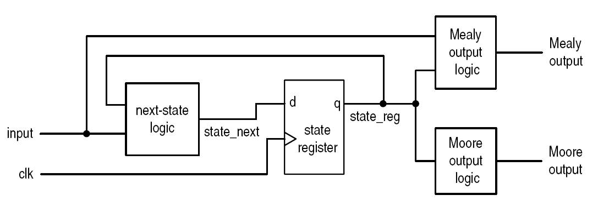


# FSM Representation


## Representation of an FSM

- State Diagram

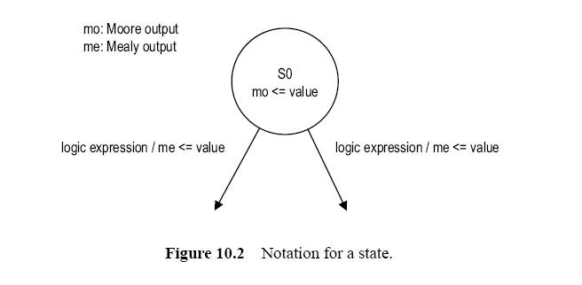


## Memory Controller State Diagram

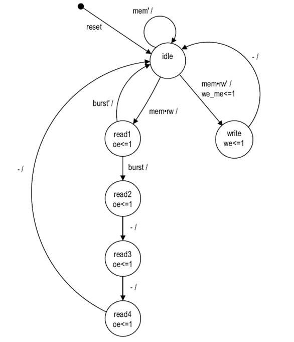


# Timing and Performance of an FSM


## Timing and Performance of an FSM

- Similar to a regular sequential circuit


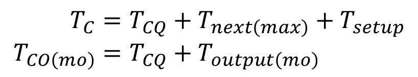


## Timing and Performance of an FSM

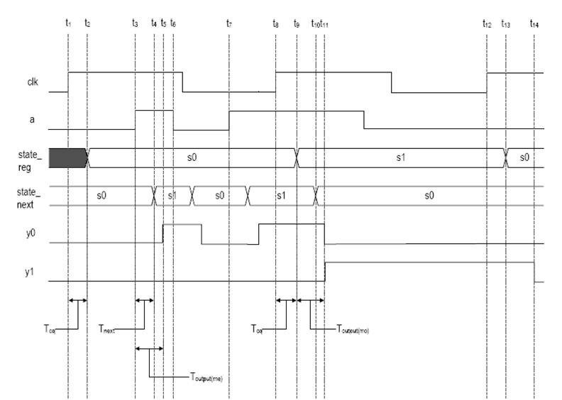


# Moore vs. Mealy


## Moore vs. Mealy

- **Moore machine**: output is a function of state
- **Mealy machine**: output function of state and inputs
- From theoretical point of view, both machines have similar "computation capability"
- Implication of FSM as a controller?


## Example: Edge Detection Circuit

- A circuit to detect the rising edge of a slow "strobe" input and generate a "short" (about 1-clock period) output pulse.

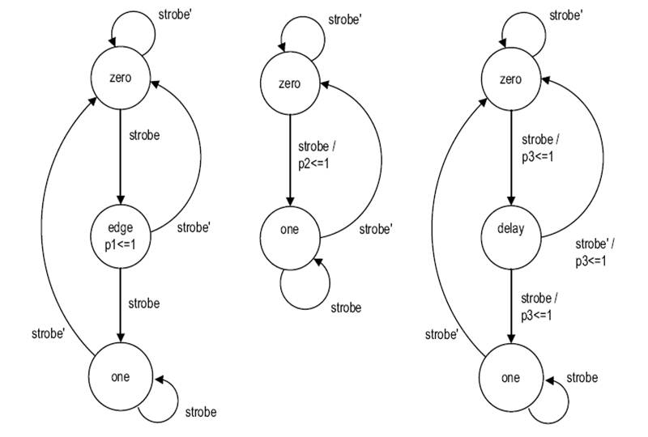


## Example: Edge Detection Circuit

- A circuit to detect the rising edge of a slow "strobe" input and generate a "short" (about 1-clock period) output pulse.

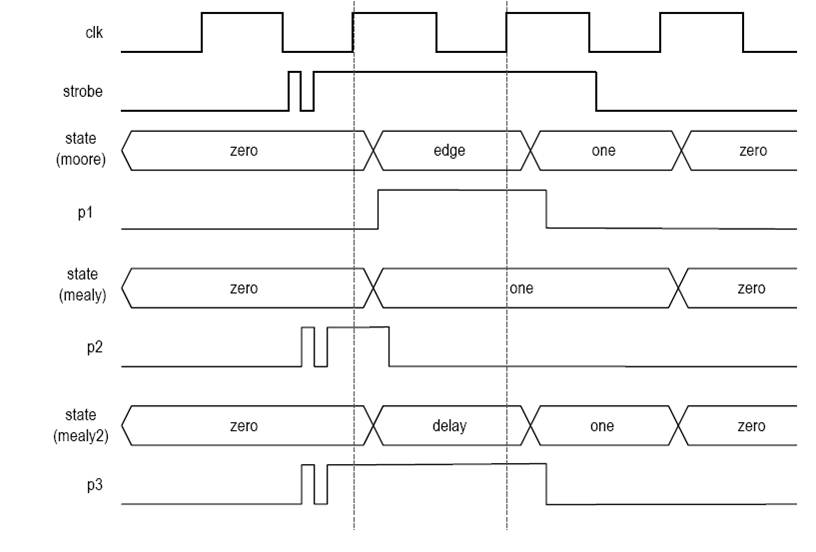


## Moore vs. Mealy

- Comparison
  - Mealy machine uses fewer states
  - Mealy machine responds faster
  - Mealy machine may be transparent to glitches (Bad!)
- Which one is better?
- Types of control signal
  - Edge sensitive
    - Example: enable signal of counter
    - Both can be used but Mealy is faster
  - Level sensitive
    - Example: write enable signal of SRAM
    - Moore is preferred


# VHDL Description of an FSM


## VHDL Description of an FSM

- Follow the basic block diagram
- Code the next-state/output logic according to the state diagram/ASM chart
- Use _enumeration_ data type for states
- Can use Moore _output buffering_ to prevent glitches

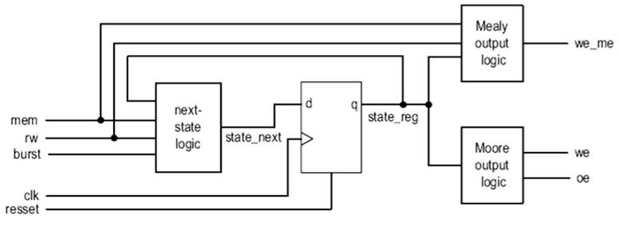


## Example


## memory_controller.vhd

```vhdl
--===================================
-- Listing 10.1 memory controller FSM
--===================================
library ieee;
use ieee.std_logic_1164.all;
entity mem_ctrl is
   port(
      clk, reset: in std_logic;
      mem, rw, burst: in std_logic;
      oe, we, we_me: out std_logic
   );
end mem_ctrl ;

architecture mult_seg_arch of mem_ctrl is
   type mc_state_type is
      (idle, read1, read2, read3, read4, write);
   signal state_reg, state_next: mc_state_type;
begin
   -- state register
   process(clk,reset)
   begin
      if (reset='1') then
         state_reg <= idle;
      elsif (clk'event and clk='1') then
         state_reg <= state_next;
      end if;
   end process;
   -- next-state logic
   process(state_reg,mem,rw,burst)
   begin
      case state_reg is
         when idle =>
            if mem='1' then
               if rw='1' then
                  state_next <= read1;
               else
                  state_next <= write;
               end if;
            else
               state_next <= idle;
            end if;
         when write =>
            state_next <= idle;
         when read1 =>
            if (burst='1') then
               state_next <= read2;
            else
               state_next <= idle;
            end if;
         when read2 =>
            state_next <= read3;
         when read3 =>
            state_next <= read4;
         when read4 =>
            state_next <= idle;
      end case;
   end process;
   -- Moore output logic
   process(state_reg)
   begin
      we <= '0'; -- default value
      oe <= '0';  -- default value
      case state_reg is
         when idle =>
         when write =>
            we <= '1';
         when read1 =>
            oe <= '1';
         when read2 =>
            oe <= '1';
         when read3 =>
            oe <= '1';
         when read4 =>
            oe <= '1';
      end case;
   end process;
   -- Mealy output logic
   process(state_reg,mem,rw)
   begin
      we_me <= '0'; -- default value
      case state_reg is
         when idle =>
            if (mem='1') and (rw='0') then
              we_me <= '1';
            end if;
         when write =>
         when read1 =>
         when read2 =>
         when read3 =>
         when read4 =>
      end case;
   end process;
end mult_seg_arch;
```


# State Assignment


## State Assignment

- State assignment: assign binary representations to symbolic states
- In a synchronous FSM
  - All assignments work
  - Good assignment reduce the complexity of next-state/output logic
- Typical assignment - Binary, Gray, one-hot, almost one-hot

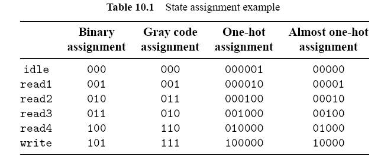


## State Assignment in VHDL

- _Implicit_: use user attributes enum_encoding 

```vhdl
type mc_state_type is (idle, write, read1, read2, read3, read4);
attribute enum_encoding : string;
attribute enum_encoding of mc_state_type :
    type is "0000 0100 1000 1001 1010 1011";
```

- _Explicit_: use std_logic_vector for the register

```vhdl
constant idle  : std_logic_vector(3 downto 0) := "0000";
constant write : std_logic_vector(3 downto 0) := "0100";
constant read1 : std_logic_vector(3 downto 0) := "1000";
constant read2 : std_logic_vector(3 downto 0) := "1001";
constant read3 : std_logic_vector(3 downto 0) := "1010";
constant read4 : std_logic_vector(3 downto 0) := "1011";
signal state_reg, state_next : std_logic_vector(3 downto 0);
...
if (reset = '1') then
    state_reg <= idle;
else
    state_reg <= idle;
end if;
```


## Handling Unused States - "Phantom States"

- Many binary representations are not used
- What happens if the FSM enters an unused state?
  - Ignore the condition
  - Safe (Fault-tolerant) FSM: go to an error state or return to the initial state.
- Easy for the explicit state assignment
- No portable code for the enumerated data type


# Moore Output Buffering


## Moore Output Buffering

- FSM as control circuit 
  - Sometimes fast, glitch-free signal is needed
  - An extra output buffer can be added, but introduce one-clock delay
- Special schemes can be used for Moore output
  - Clever state assignment
  - Look-ahead output circuit
- Potential problems of the Moore output logic:
  - Potential hazards introduce glitches
  - Increase the Tco delay (Tco = Tcq + Toutput)
- Can we get control signals directly from the register?


## Clever State Assignment

- Assigning state according to output signal patterns
- Output can be obtained from register directly 
- Extra register bits may be needed
- Must use explicit state assignment in VHDL code to access individual register bit
- Difficult to revise and maintain

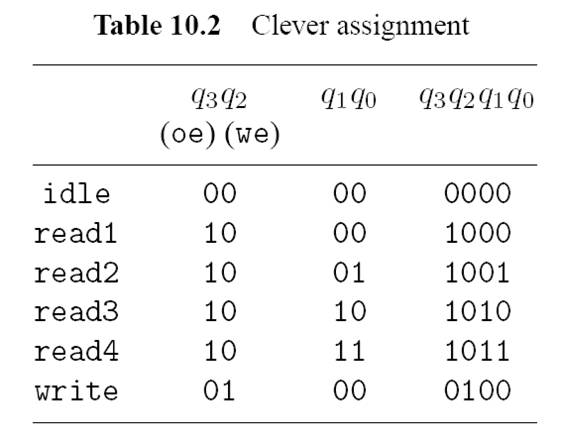


## Look-Ahead Output Circuit

- Output buffer introduces one-clock delay
- The "next" value of Moore output can be obtained by using `state_next` signal 
- Buffer the next value cancel out the one-clock delay 
- More systematic and easier to revise and maintain

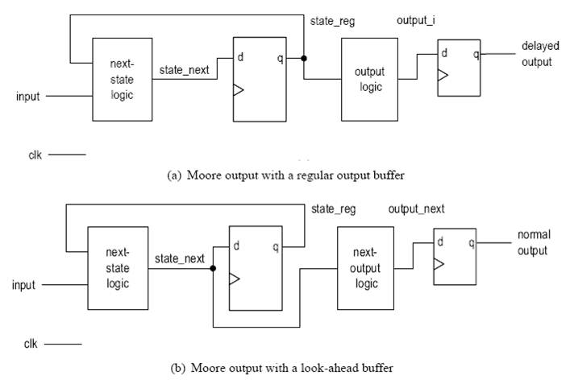
